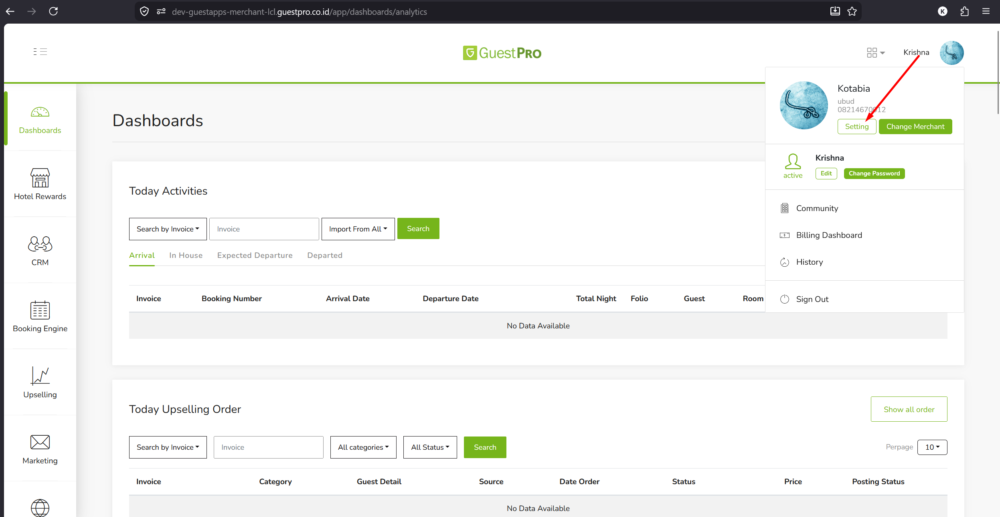
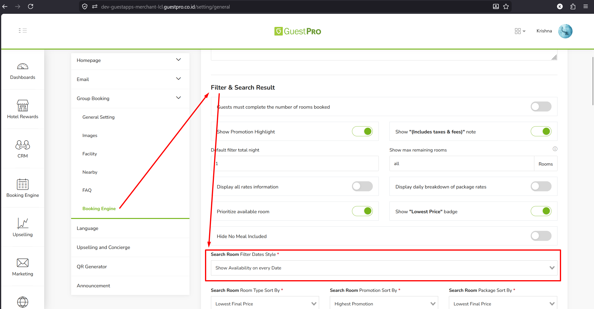
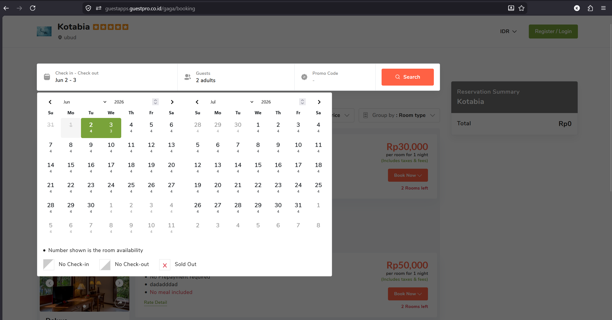
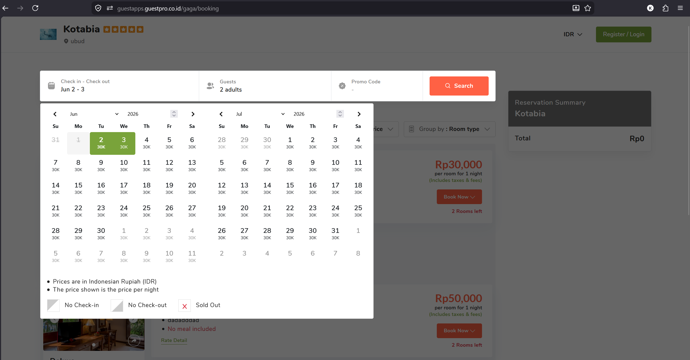

Booking Engine (BE) memiliki konfigurasi yang memungkinkan *merchant* mengatur jenis informasi yang muncul pada kalender pemilihan tanggal.

Secara standar, kalender hanya menampilkan **harga termurah** (*Show Lowest Price*). Melalui konfigurasi ini, kalender bisa diubah untuk menampilkan **total sisa kamar** (*Show Availability*) — angka ketersediaan yang muncul merupakan gabungan kuota dari seluruh tipe kamar yang sedang aktif pada tanggal yang dipilih.

## Panduan Konfigurasi

1. **Akses Menu Pengaturan Properti** — Login ke dashboard merchant. Pada bilah navigasi kiri, arahkan ke bagian bawah dan pilih menu **Setting**.

   

2. **Masuk ke Pengaturan Booking Engine** — Pada submenu vertikal di sisi tengah-kiri, klik opsi **Booking Engine**, lalu gulir halaman ke bawah hingga menemukan section bertajuk **Filter & Search Result**.

   

3. **Mengubah Gaya Kalender Tanggal** — Cari dropdown field bernama **Search Room Filter Dates Style**. Pilih sesuai kebutuhan:
   - Pilih **Show Availability on every Date** untuk menampilkan total sisa kamar gabungan di kalender.

     

   - Pilih **Show Lowest Price** untuk mengembalikan kalender ke mode standar (harga termurah).

     

4. **Menyimpan Perubahan** — Klik tombol **Save** di bagian bawah halaman untuk menerapkan konfigurasi ke frontend.
