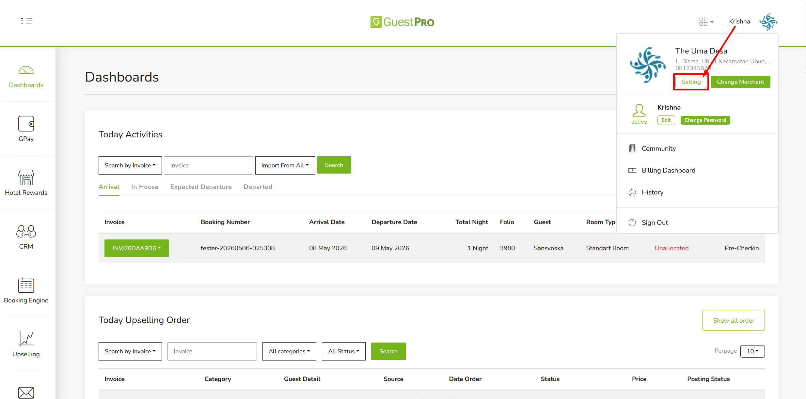
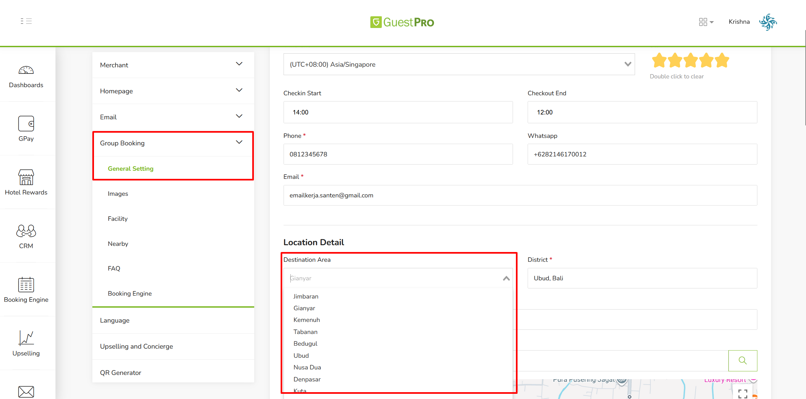
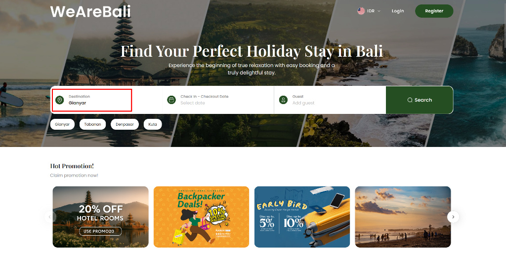
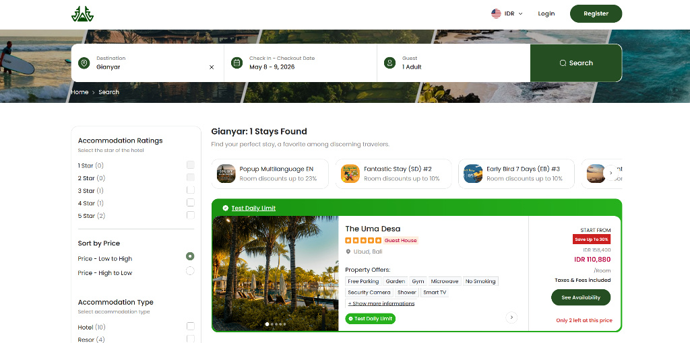
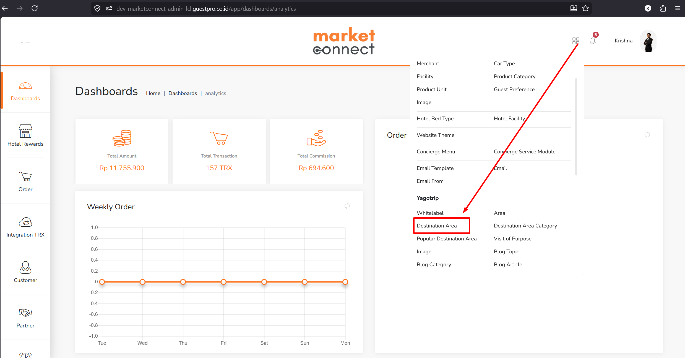
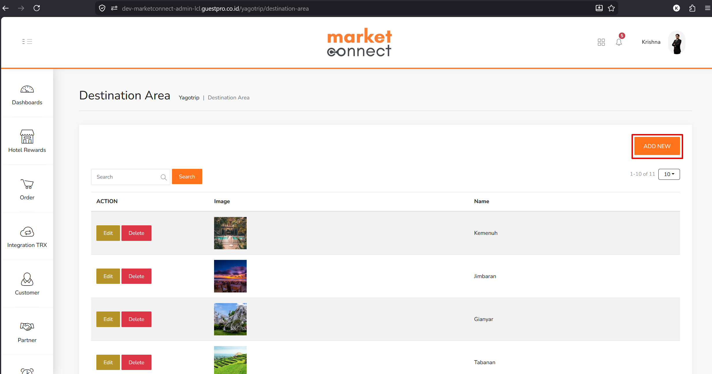

**Destination Area** adalah pengaturan lokasi spesifik yang berfungsi untuk memetakan dan mengelompokkan sebuah properti ke dalam wilayah pencarian tertentu pada portal pemesanan gabungan (seperti portal *WeAreBali*).

:::caution[Syarat Kemunculan Fitur]
Pengaturan **Destination Area** bersifat eksklusif — menu ini **hanya muncul dan dapat diakses** oleh merchant/properti yang sudah berafiliasi atau tergabung ke dalam sebuah **Community** atau **Group Booking**.

Jika sebuah properti berdiri sendiri (*standalone*) dan tidak tertaut dengan ekosistem portal grup atau komunitas apa pun, maka menu navigasi **Group Booking** beserta pengaturan **Destination Area** di dalamnya tidak akan ditampilkan di Dashboard GuestPRO mereka.
:::

## Alur Kerja Konfigurasi (Sisi Merchant)

### 1. Verifikasi Status Komunitas & Akses Pengaturan

Merchant (dalam contoh ini: properti *The Uma Desa*) mengakses sistem melalui menu **Setting** pada dropdown profil pengguna di pojok kanan atas. Hak akses ini memastikan pengguna masuk ke pengaturan spesifik merchant yang memiliki afiliasi dengan komunitas.

### 2. Penentuan Area Destinasi

Setelah masuk ke pengaturan merchant, navigasikan ke menu **Group Booking → General Setting** di panel sebelah kiri. Pada bagian **Location Detail**, terdapat dropdown **Destination Area**. Di sinilah merchant mengunci lokasi mereka ke dalam kategori wilayah grup (misalnya memilih: **Gianyar**). Langkah ini adalah jembatan penghubung antara data internal hotel dengan filter pencarian di portal publik komunitas.

### 3. Implementasi pada Portal Pencarian (Front-End)

Di sisi tamu, pada portal komunitas terpadu (contoh: *WeAreBali*), terdapat widget pencarian utama. Tamu menggunakan kolom **Destination** untuk mencari area spesifik yang ingin mereka kunjungi (dalam hal ini, tamu memilih **Gianyar**).

### 4. Validasi Hasil Pencarian

Saat tamu menekan tombol **Search**, sistem portal komunitas akan menarik data dari semua merchant yang tergabung di dalam grup tersebut, namun **hanya memfilter** properti yang tag Destination Area-nya cocok dengan kata kunci pencarian. Hasilnya tervalidasi dengan munculnya properti ***The Uma Desa*** di bawah keterangan **"Gianyar: 1 Stays Found"**.

:::note[Kesimpulan]
Destination Area adalah fondasi dari fitur pencarian lokasi pada portal Group Booking. Fitur ini menyortir ratusan atau ribuan properti dalam satu komunitas ke dalam direktori wilayah yang rapi. Tanpa pengaturan ini (atau jika merchant tidak tergabung dalam grup), properti tidak akan memiliki parameter untuk dapat ditemukan melalui filter lokasi pada portal komunitas gabungan.
:::

## Menambahkan Destination Area Baru (Sisi Admin Market Connect)

*Master data* untuk daftar pilihan "Destination Area" dikelola terpusat dari sisi Admin GuestPRO. Berikut alur kerja bagi tim admin untuk menambahkan area destinasi baru ke dalam sistem:

1. **Akses Menu Navigasi Utama** — Masuk ke Dashboard Admin Market Connect, lalu klik ikon grid (kotak-kotak) di pojok kanan atas layar untuk membuka menu navigasi lengkap.

   

2. **Pilih Kategori Yagotrip** — Pada daftar menu yang muncul, arahkan pandangan ke bagian kelompok menu **Yagotrip**.
3. **Buka Pengaturan Destinasi** — Klik opsi **Destination Area** di bawah kategori tersebut.
4. **Tambahkan Data Baru** — Akan diarahkan ke halaman tabel yang menampilkan daftar destinasi yang sudah aktif (seperti Kemenuh, Jimbaran, dll). Klik tombol **ADD NEW** berwarna oranye di sudut kanan atas untuk membuat titik area destinasi baru.

   

:::tip[Catatan Integrasi]
Setiap lokasi baru yang berhasil ditambahkan melalui halaman Admin ini akan langsung terhubung ke database dan secara otomatis muncul sebagai pilihan pada dropdown **Destination Area** di sisi merchant.
:::
