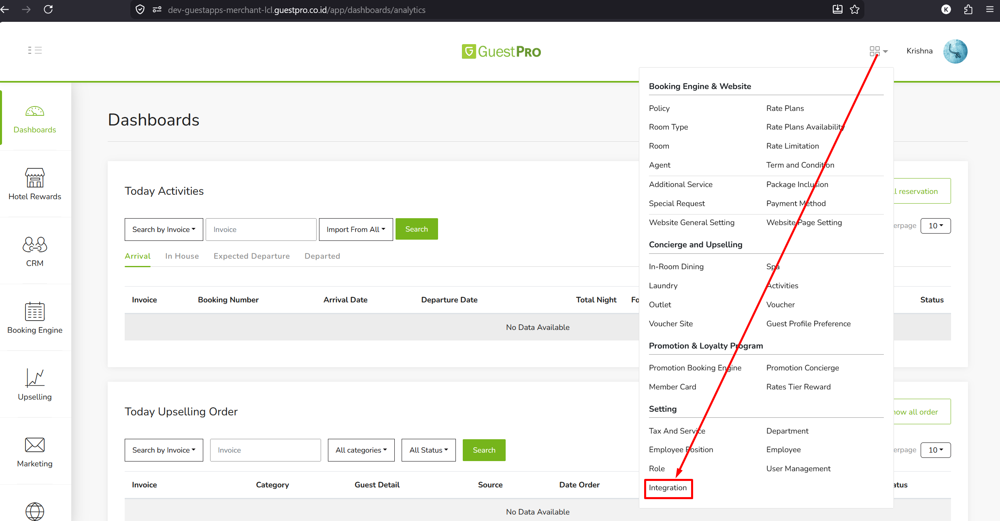
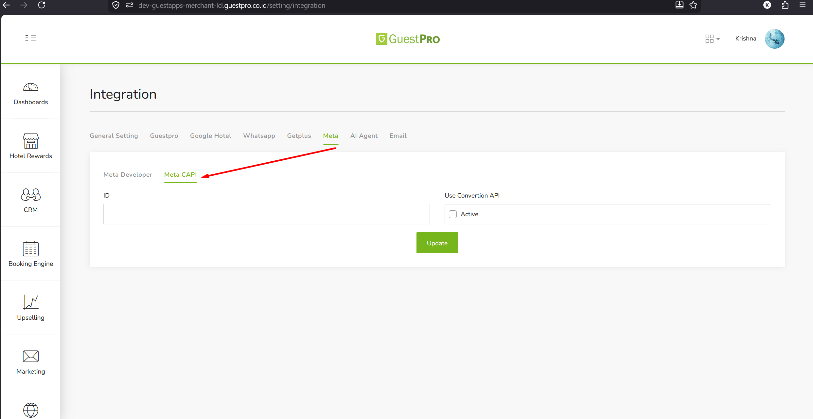
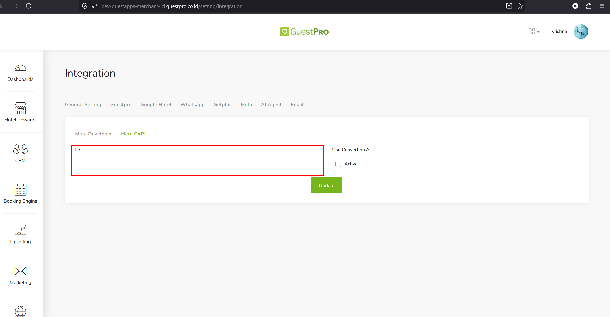
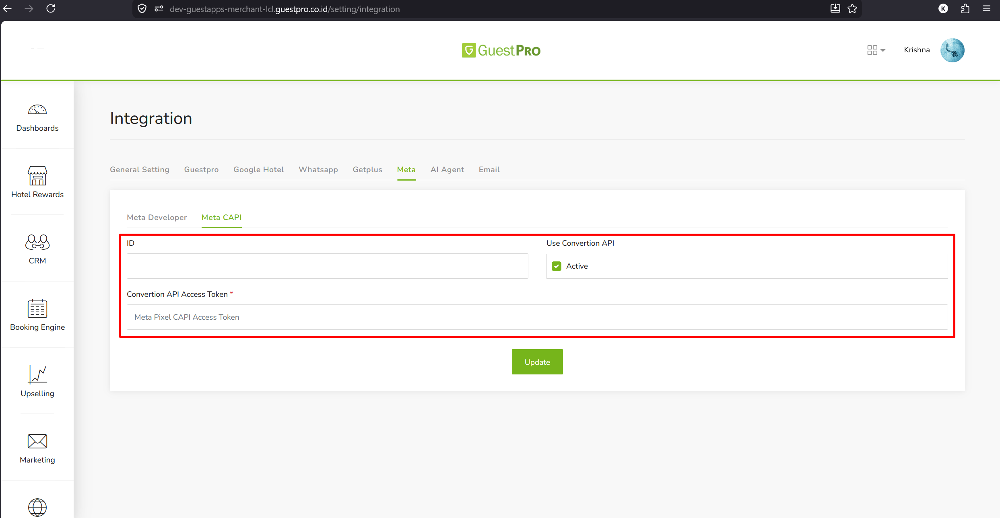

Meta Pixel dan Meta Conversion API (CAPI) digunakan untuk melacak konversi dari Booking Engine ke akun iklan Meta (Facebook/Instagram) milik klien/properti.

## Langkah 1 — Navigasi ke Menu Integrasi

Pada dashboard utama, klik ikon menu berbentuk empat kotak di sudut kanan atas. Temukan kategori **Setting** di bagian bawah dropdown menu tersebut, lalu klik opsi **Integration**.

## Langkah 2 — Mengakses Pengaturan Meta

Di halaman **Integration**, pilih tab menu **Meta**. Di dalam menu tersebut, klik pada pilihan sub-tab **Meta CAPI**.

## Langkah 3 — Konfigurasi Meta Pixel (Standar)

Untuk pengaturan Meta Pixel standar, cukup berfokus pada kotak input **ID**:

1. Masukkan deretan angka Pixel ID klien ke dalam kotak **ID**.
2. Klik tombol hijau **Update** untuk menyimpan data.

## Langkah 4 — Konfigurasi Meta CAPI

Jika klien ingin menggunakan Conversions API:

1. Berikan tanda centang pada kotak **Active** di bagian **Use Convertion API**. Tindakan ini akan memunculkan satu kolom input tambahan yang wajib diisi, yaitu **Convertion API Access Token**.
2. Isi kolom **ID** dengan Pixel ID klien.
3. Masukkan token dari klien ke dalam kolom **Convertion API Access Token**.
4. Klik tombol **Update** untuk menyimpan seluruh pengaturan.

