Channex acts as a *channel manager* that connects messages from OTAs (Booking.com, Airbnb, Expedia, and others) to the GuestChat inbox. Setting up Channex requires four stages: installing the app in Channex, webhook integration, connecting to the GuestPro dashboard, and activating the Chat feature in Admin GP.

## Stage 1 — Install Channex Messages

1. Log in to the property's Channex account.
2. Click the **Applications** menu in the top navbar.
3. Select **Manage Apps** from the dropdown.

   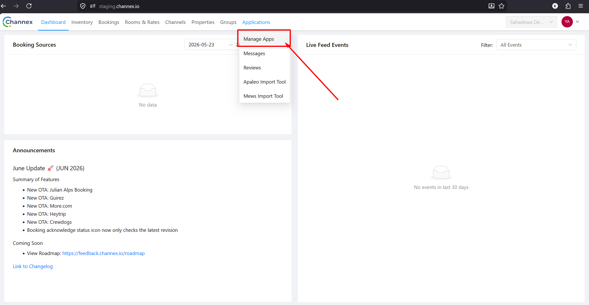

4. On the Applications page, find and click **Channex Messages**.

   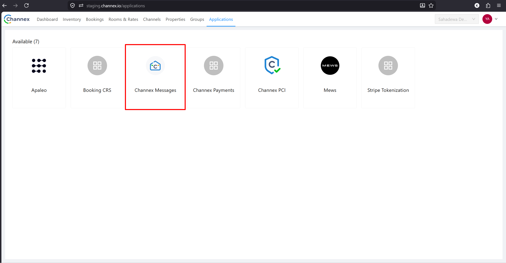

5. Click the **Install** button on the confirmation popup.

   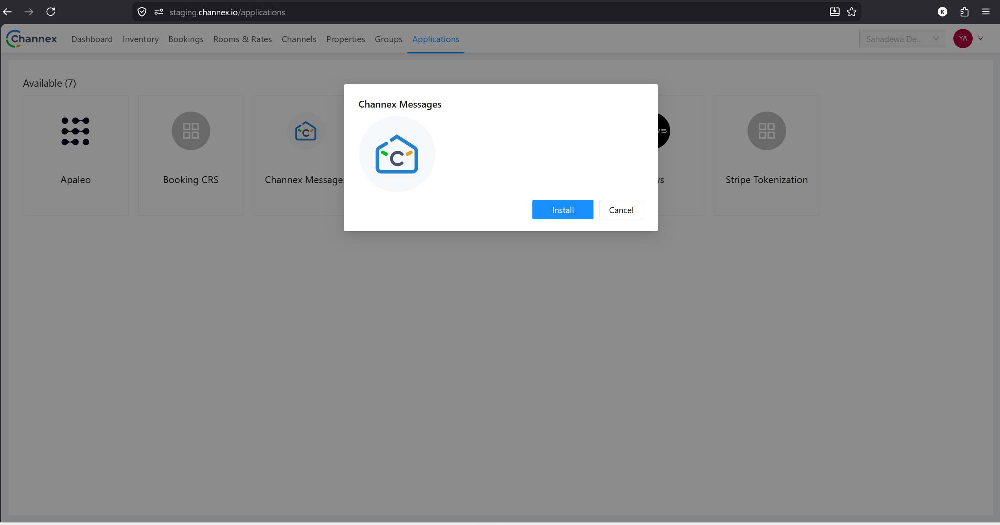

## Stage 2 — Webhook Integration

1. Click the account avatar/name in the top-right corner, select **Organization**.

   

2. In the left sidebar, select **Property Webhooks**.

   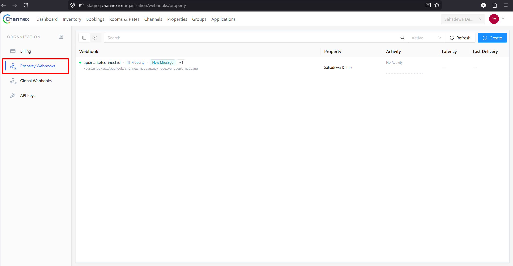

3. Click the **Create** button in the top-right corner.
4. Fill in the Create Webhook form:
   - **Trigger:** New Message + New Review
   - **Callback URL:** `https://api.marketconnect.id/admin-gp/api/webhook/channex-messaging/receive-event-message`
   - **Property:** select the property being set up
   - **Is Active:** check ✅
   - **Send Data:** check ✅

   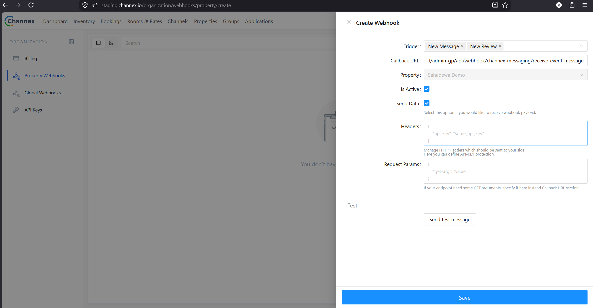

   :::tip[Before saving]
   Before saving, click **Send test message** in the **Test** section to confirm the webhook connection is successful. If successful, a **Success** response with status `200` will appear.
   :::

   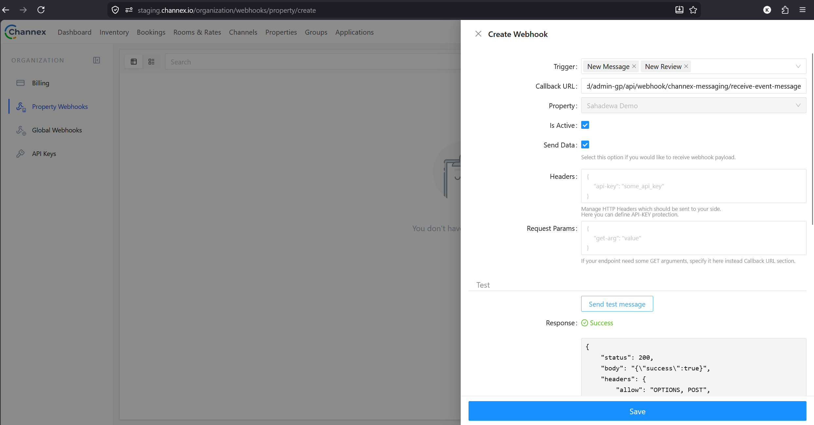

5. Click **Save**.

## Stage 3 — Integration in the GuestPro Dashboard (Booking Engine)

1. Log in to the GuestPro merchant dashboard.
2. Go to **Setting → Integration → Channel Manager**.
3. Select **CHANNEX** as the Channel Manager.
4. Fill in the following two fields: **CM Hotel ID** and **CM API Key**.

   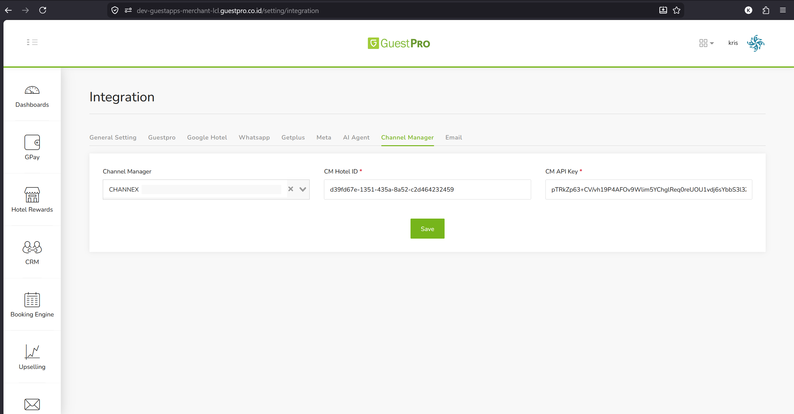

**How to get the CM Hotel ID:**

- Open Channex → **Properties** menu
- Click **Actions → Edit** on the relevant property
- Copy the ID shown at the top of the Edit Property form

  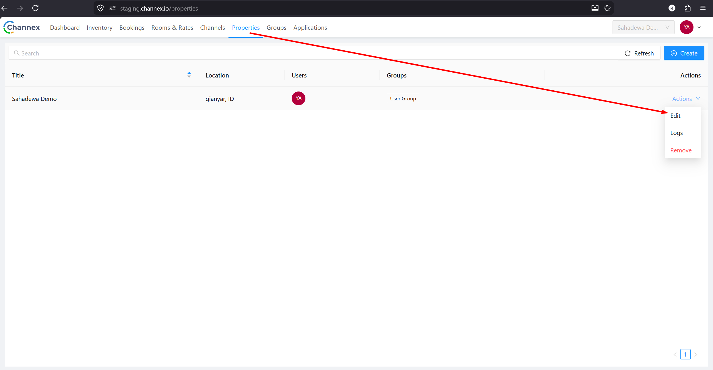

  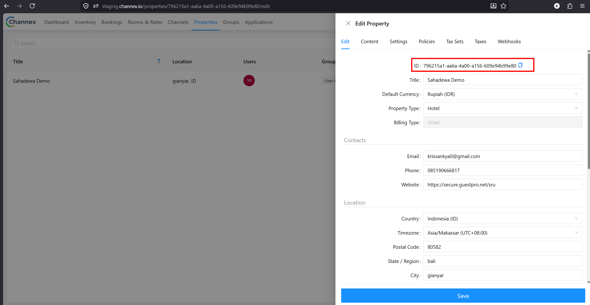

**How to get the CM API Key:**

- Open Channex → click the avatar → **Organization**
- Select **API Keys** in the left sidebar
- Use an existing API Key, or click **Create new API Key**

  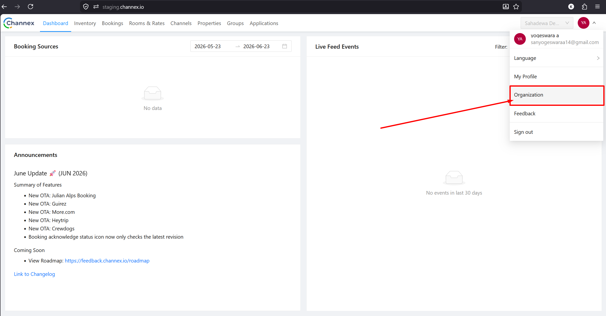

5. Once both fields are filled in, click **Save**.

   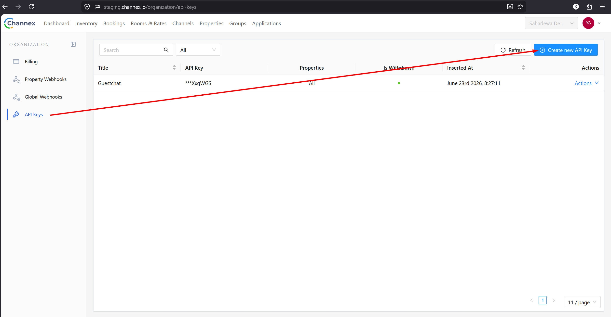

## Stage 4 — Activate GuestChat in Admin GP

1. Open **MarketConnect → Merchant Detail** for the relevant property.
2. On the **General** tab, find the **Chat App** toggle.
3. Activate the toggle.

   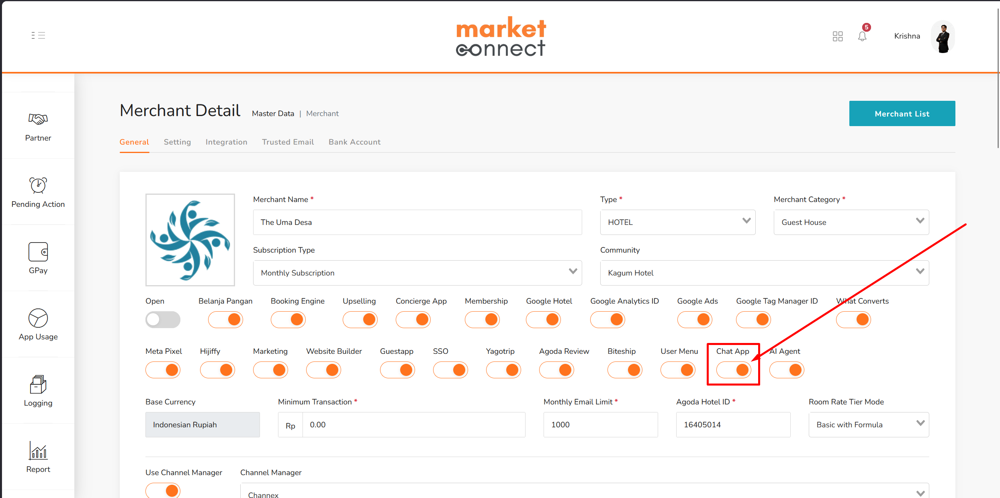

4. Check the GuestPro merchant dashboard — the **Chat** menu should now appear in the left sidebar.

   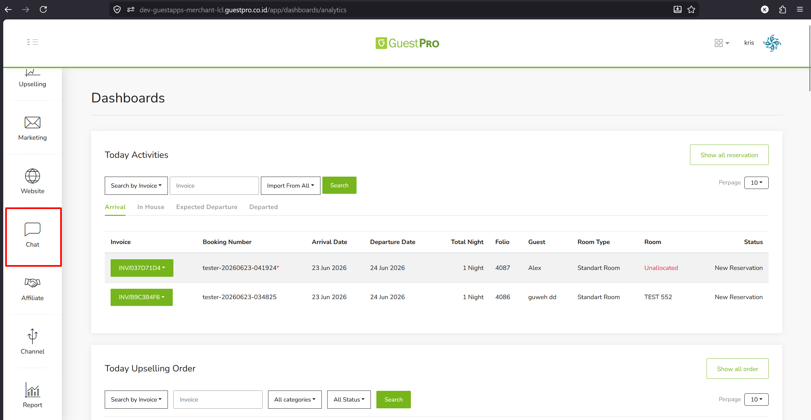
