Fonnte is used to connect the property's WhatsApp number to GuestChat. Setting up Fonnte requires three stages: configuring the device & webhook in the Fonnte dashboard, connecting the device to WhatsApp, and then syncing the token in the GuestPro Merchant dashboard.

## Stage 1 — Set Up the Device & Webhook in the Fonnte Dashboard

1. Open [fonnte.com](https://fonnte.com/), then Log in or Sign up for a Fonnte account first.

   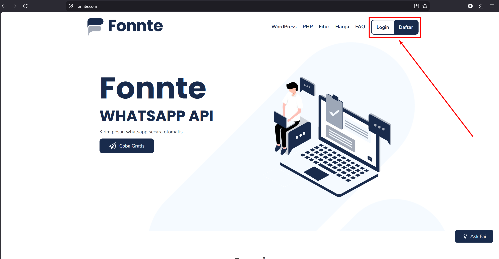

2. In the Fonnte dashboard, open the **Device** menu.

   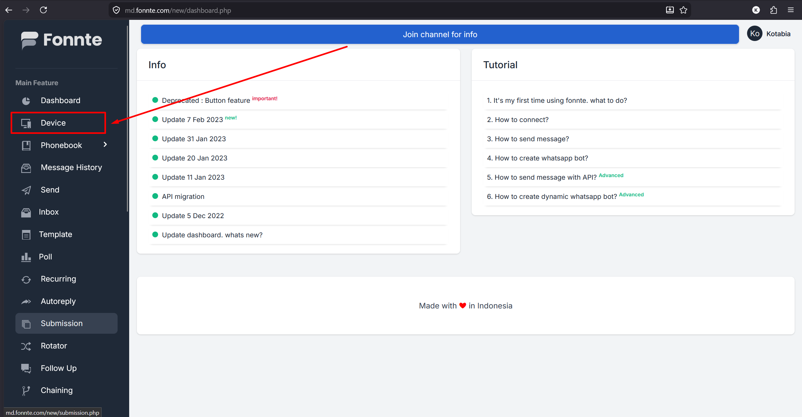

3. Click **Add Device** if you don't have one yet.

   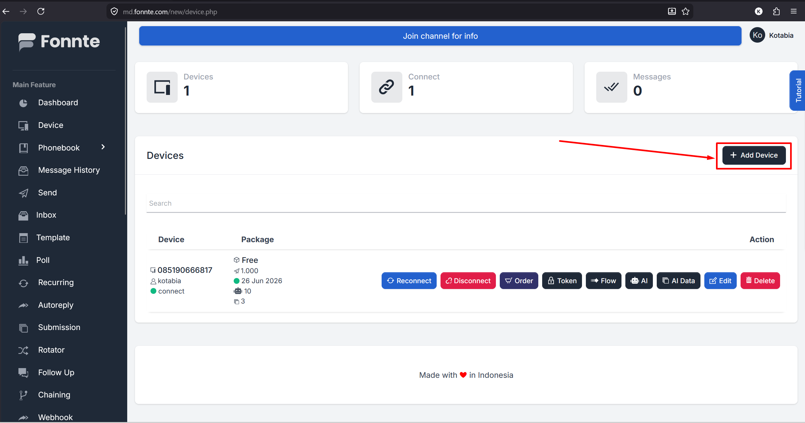

4. Fill in **Device Name** and **Device Number**, then enable the **Chatbot** and **Personal** toggles as shown, and click **Add Device**.

   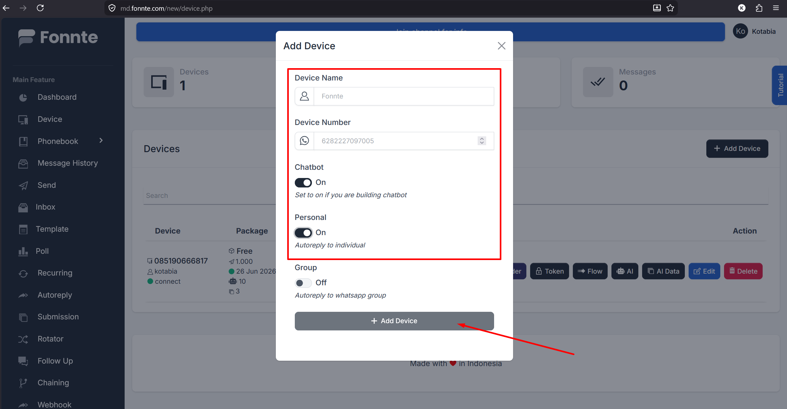

5. Click **Edit** on the newly created device to add a webhook.

   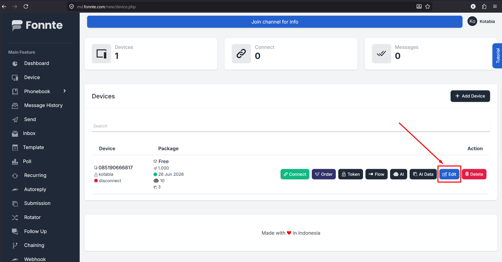

6. In the **Webhook** field, enter the following URL, then click **Save/Update**:

   Webhook: `https://api.marketconnect.id/admin-gp/api/webhook/fonnte/receive-event-message`

   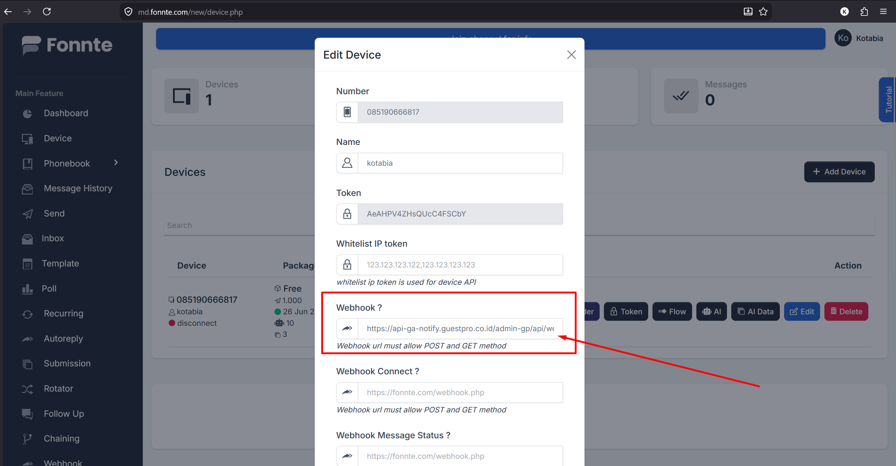

## Stage 2 — Connect the Device to WhatsApp

1. After the webhook is added, the device is still in **disconnect** status and not yet connected to WhatsApp.

   

2. Click the **Connect** button on that device.

   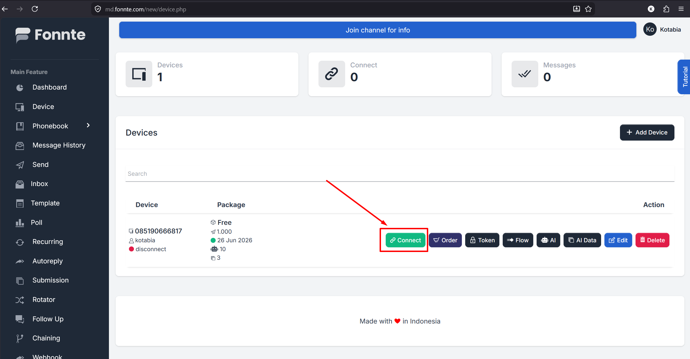

3. Choose a connection method (**QR** or **Number**), then follow the on-screen steps until finished.

   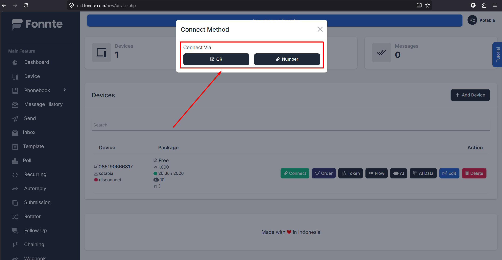

4. Once connected successfully, the device status changes to **connect**.

   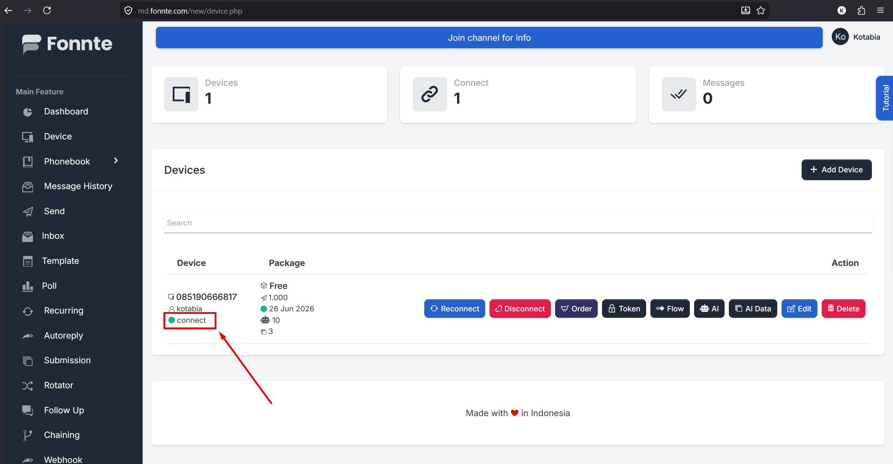

## Stage 3 — Sync the Token in the GuestPro Merchant Dashboard

1. Log in to [GuestPro Revenue Booster](https://revenue-booster.guestpro.net/), then open the **Integration** menu.

   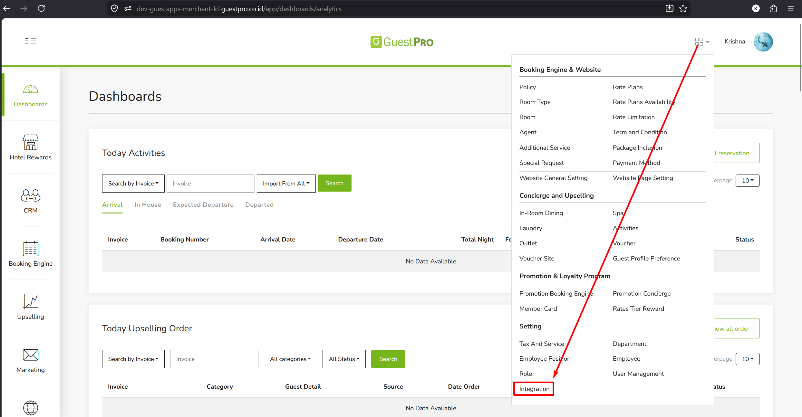

2. On the Integration page, open the **Whatsapp** tab.

   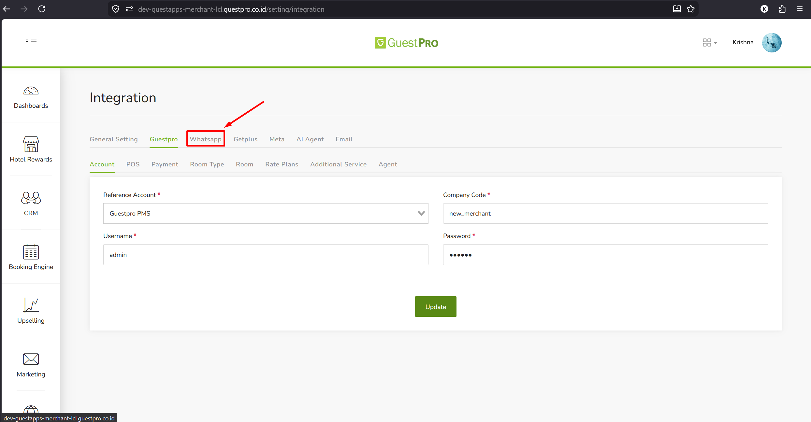

3. Inside the Whatsapp tab, select the **Fonnte** sub-tab. A **Fonnte Device Token** field will appear, still empty.

   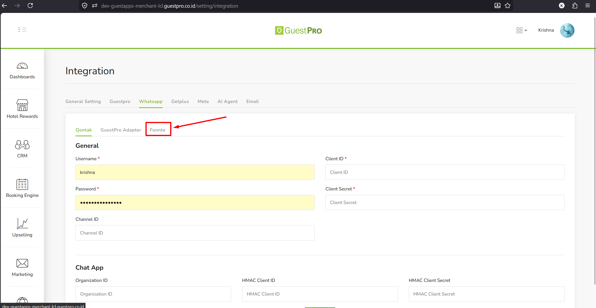

   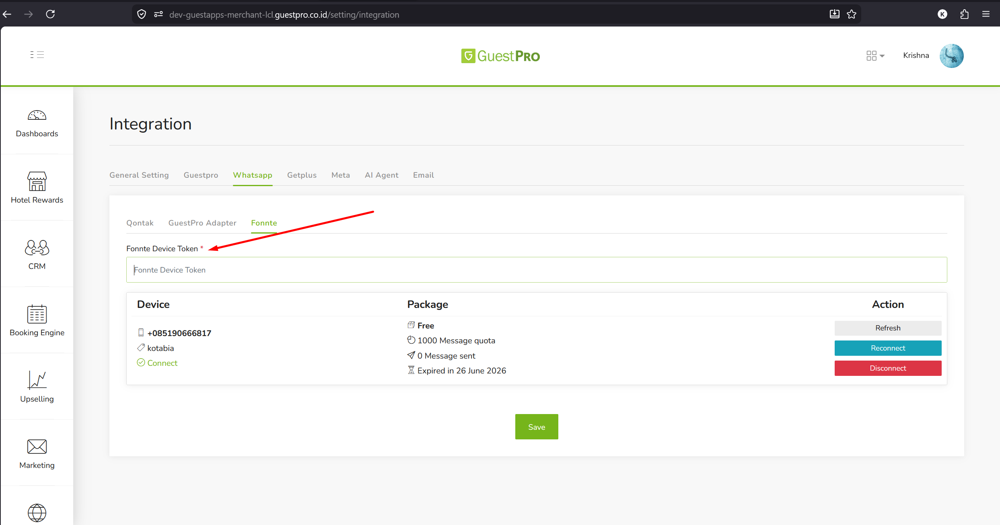

**How to get the Fonnte Device Token:**

- Open the Fonnte dashboard → **Device** menu
- Click the **Token** icon on the connected device — the token is automatically copied to the clipboard

  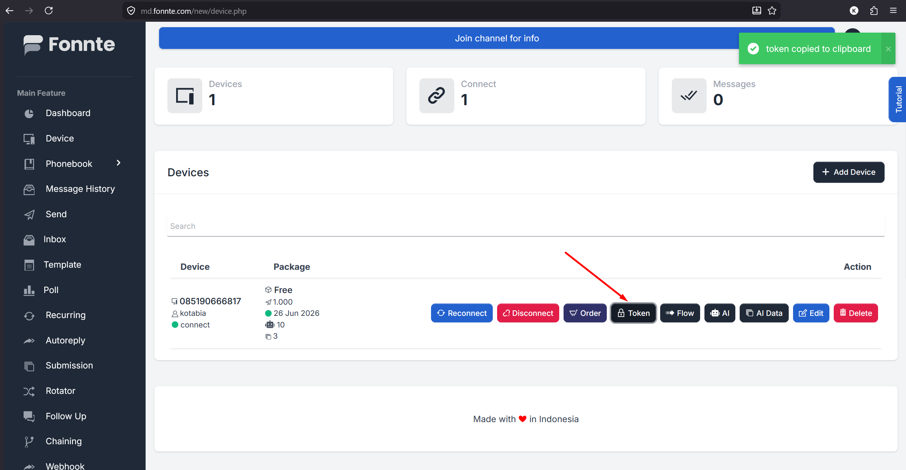

4. Back in the Merchant dashboard, paste the token into the **Fonnte Device Token** field, then click **Save**.

   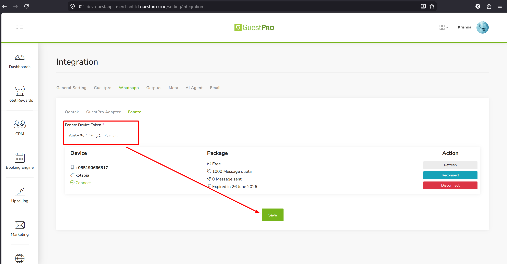

5. Once saved, click **Refresh** then **Reconnect** to sync the device status.

   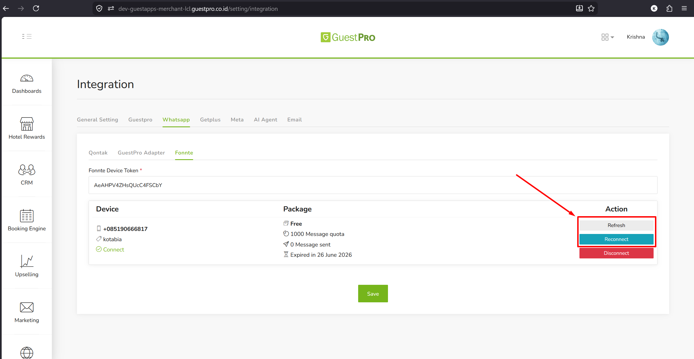

:::note[Note]
For the risks and limitations of using Fonnte's unofficial WhatsApp connection (e.g. for outbound/broadcast), see the note on the [Channel Setup & Integration page](/en/guestchat/channels/).
:::
