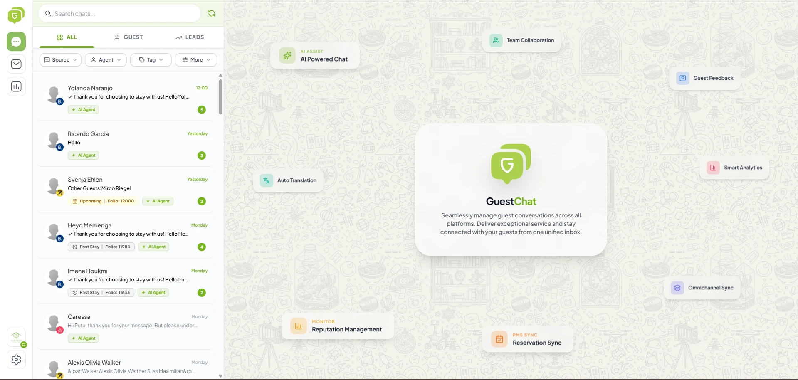

With GuestChat, every conversation with a guest (whether from WhatsApp or Webchat) can be managed directly from a single dashboard. The team doesn't need to switch between apps or lose track of a chat.

## Receive & Reply to WhatsApp Messages Directly from GuestChat

Every incoming WhatsApp message from a guest automatically appears in the GuestChat inbox, and the property team can reply directly from there. Guests still receive replies on their WhatsApp as usual, while the team only needs to work from one screen.

**Benefits:**

- No guest chat gets missed, since everything is centralized in one place.
- Faster responses, since the team doesn't need to switch devices or apps.
- Conversation history is kept tidy and linked to the guest's profile.

## AI Assistant vs AI Agent — Quick Overview

GuestChat has two levels of AI assistance. Full details are on the [AI Assistant & AI Agent page](/en/guestchat/ai-agent/), but here's the core difference:

| | **AI Agent** | **AI Assistant** |
|---|---|---|
| **Setup required** | Must be activated by the property first | Always available, no setup |
| **Context understanding** | Reads previous chat flow for relevant answers | Generic templates/drafts, no context reading |
| **Best for** | Personalized replies tailored to specific guest needs | Quickly drafting a neat reply |

:::tip[Key point]
Even if the property **hasn't** activated AI Agent, **AI Assistant is still usable**. Once AI Agent is activated, suggestion quality improves because the AI starts understanding conversation context.
:::

## Quick Navigation

- [Channel Setup & Integration](/en/guestchat/channels/) — Fonnte, Qontak, Meta, Channex
- [AI Assistant & AI Agent](/en/guestchat/ai-agent/) — sub-agent details and settings
- [Manage Conversations & Leads](/en/guestchat/manage-conversations/) — Management menu, Leads, Sales Funnel, Webchat Widget
