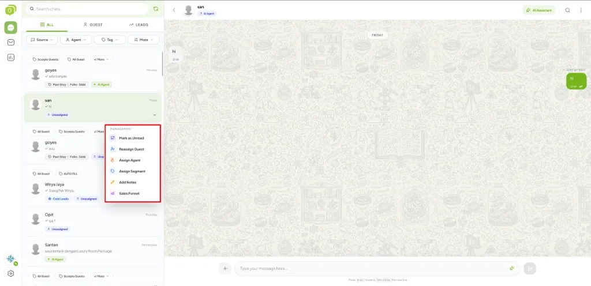
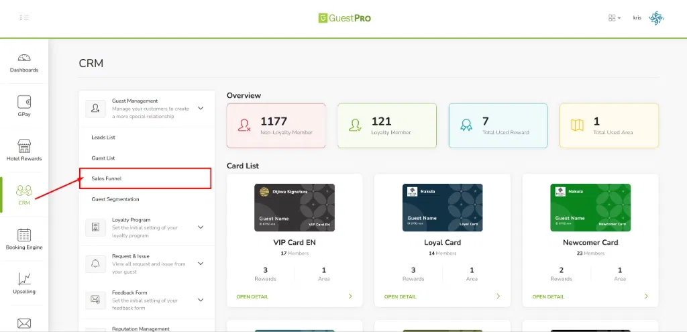
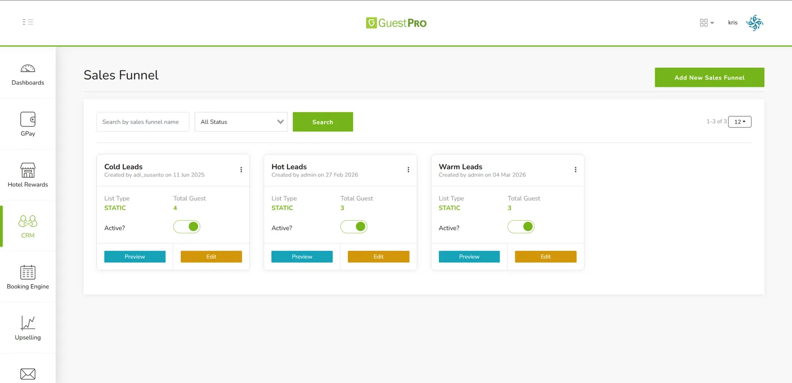
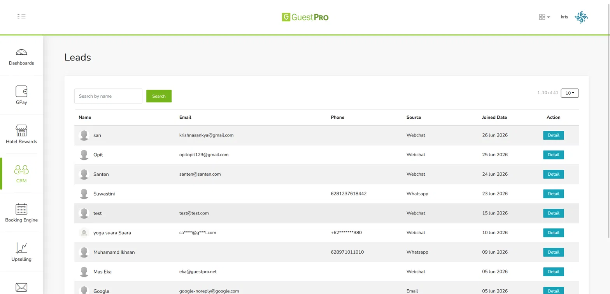

## Management Menu on a Conversation

Every conversation has a **Management** menu to help the team organize and follow up on chats. Open the menu on the selected conversation, then use the following options:

| Feature | Function |
|---|---|
| **Mark as Unread** | Marks a conversation as unread, so it's easy to follow up on later and doesn't get missed. |
| **Reassign Guest** | Links/moves the conversation to the correct guest profile, so chat data always connects to the right guest. |
| **Assign Agent** | Assigns the conversation to a specific staff member/agent, so it's clear who's responsible. |
| **Assign Segment** | Places the guest into a specific segment for more targeted communication/offer strategies. |
| **Add Notes** | Adds internal notes about the guest/conversation, so the whole team shares the same context. |
| **Sales Funnel** | Places the guest into a sales funnel stage (Cold, Warm, or Hot Leads) to keep sales opportunities tracked. |

Through this feature, chats can be managed as part of the service and sales process, not just replied to one by one.

## Leads: Capture Every Prospective Guest from the First Message

Every guest who chats for the first time is automatically recorded as a **Lead**. The property team can immediately decide that prospective guest's direction — Cold, Warm, or Hot Leads — based on their potential and interest.

This way, everyone who reaches out to the property is immediately recorded and ready to be followed up on, so no opportunity is wasted.

## Sales Funnel: Map the Prospective Guest's Journey

**Menu location:** `CRM → Guest Management → Sales Funnel`

On this page, the property can view and manage funnel groups such as Cold Leads, Warm Leads, and Hot Leads, complete with the number of guests at each stage and their active/inactive status.

:::note[Note]
Sales Funnel entries are currently managed **manually** (assigned directly by the team), giving the property full control over determining each prospective guest's position.
:::

## Monitor Leads Directly from the Dashboard

**Menu location:** `CRM → Guest Management → Leads List`

All prospective guests are displayed complete with **Name, Email, Phone Number, Source, and Join Date**. The *Source* column shows where the guest came from, such as WhatsApp or Webchat, so the property knows which channel brings in the most prospective guests.

