Channex berperan sebagai *channel manager* yang menghubungkan pesan dari OTA (Booking.com, Airbnb, Expedia, dan lainnya) ke inbox GuestChat. Setup Channex membutuhkan empat tahap: instalasi app di Channex, integrasi webhook, koneksi ke dashboard GuestPro, dan aktivasi fitur Chat di Admin GP.

## Tahap 1 — Install Channex Messages

1. Login ke akun Channex property.
2. Klik menu **Applications** di navbar atas.
3. Pilih **Manage Apps** dari dropdown.

   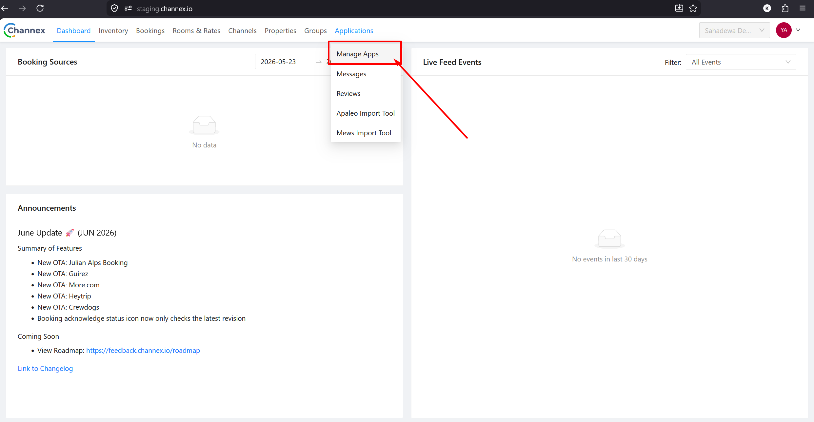

4. Di halaman Applications, temukan dan klik **Channex Messages**.

   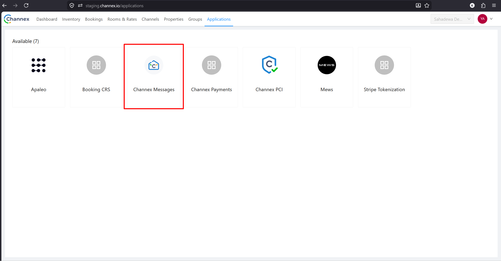

5. Klik tombol **Install** pada popup konfirmasi.

   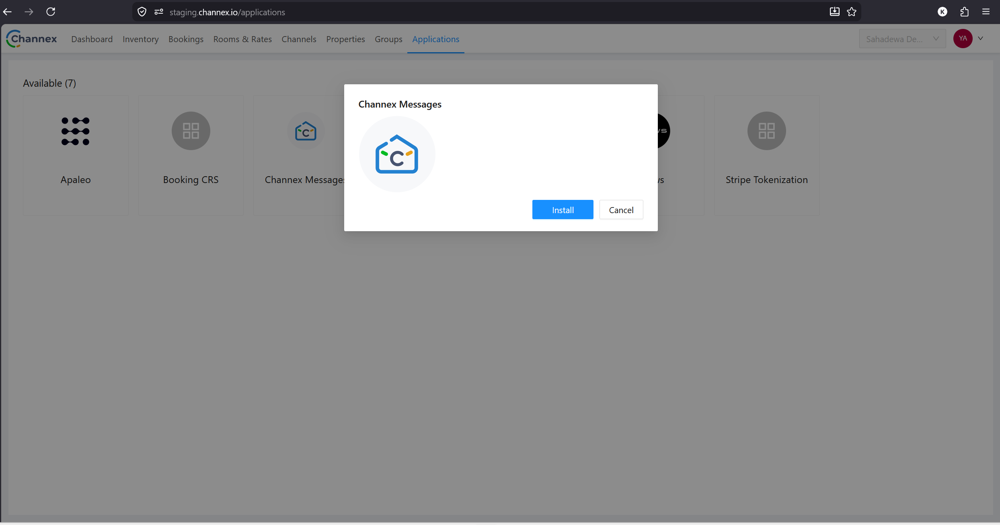

## Tahap 2 — Integrasi Webhook

1. Klik avatar/nama akun di pojok kanan atas, pilih **Organization**.

   

2. Di sidebar kiri, pilih **Property Webhooks**.

   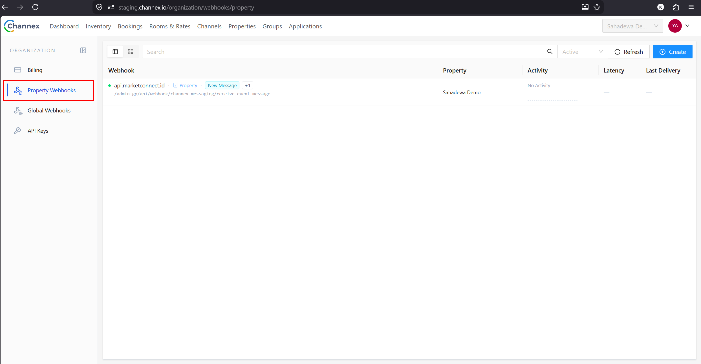

3. Klik tombol **Create** di pojok kanan atas.
4. Isi form Create Webhook:
   - **Trigger:** New Message + New Review
   - **Callback URL:** `https://api.marketconnect.id/admin-gp/api/webhook/channex-messaging/receive-event-message`
   - **Property:** pilih property yang akan disetup
   - **Is Active:** centang ✅
   - **Send Data:** centang ✅

   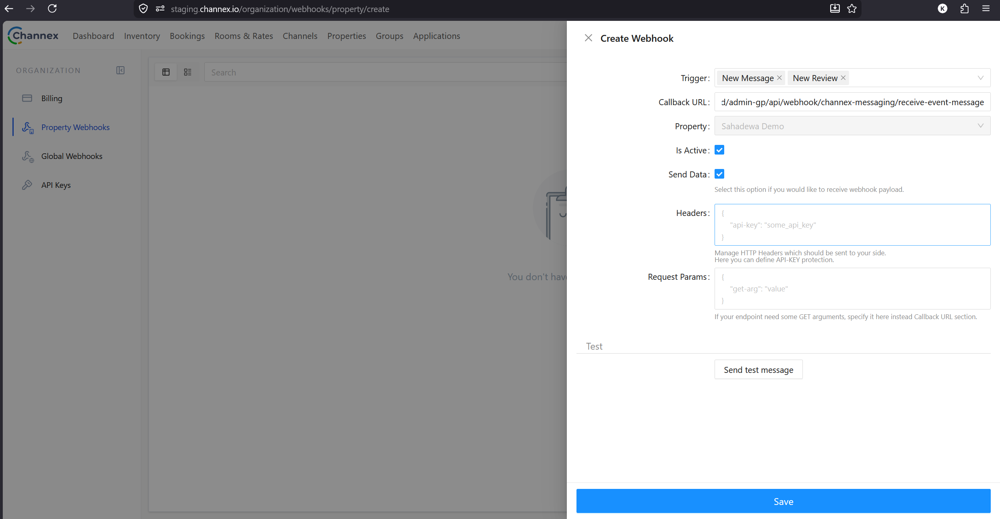

   :::tip[Sebelum Save]
   Sebelum menyimpan, klik **Send test message** di bagian **Test** untuk memastikan koneksi webhook berhasil. Jika berhasil, akan muncul response **Success** dengan status `200`.
   :::

   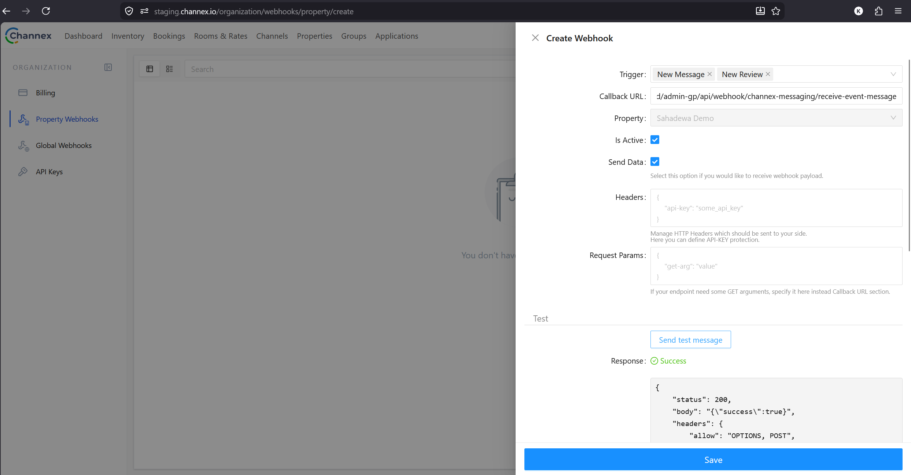

5. Klik **Save**.

## Tahap 3 — Integrasi di Dashboard GuestPro (Booking Engine)

1. Login ke GuestPro dashboard merchant.
2. Masuk ke **Setting → Integration → Channel Manager**.
3. Pilih **CHANNEX** sebagai Channel Manager.
4. Isi dua field berikut: **CM Hotel ID** dan **CM API Key**.

   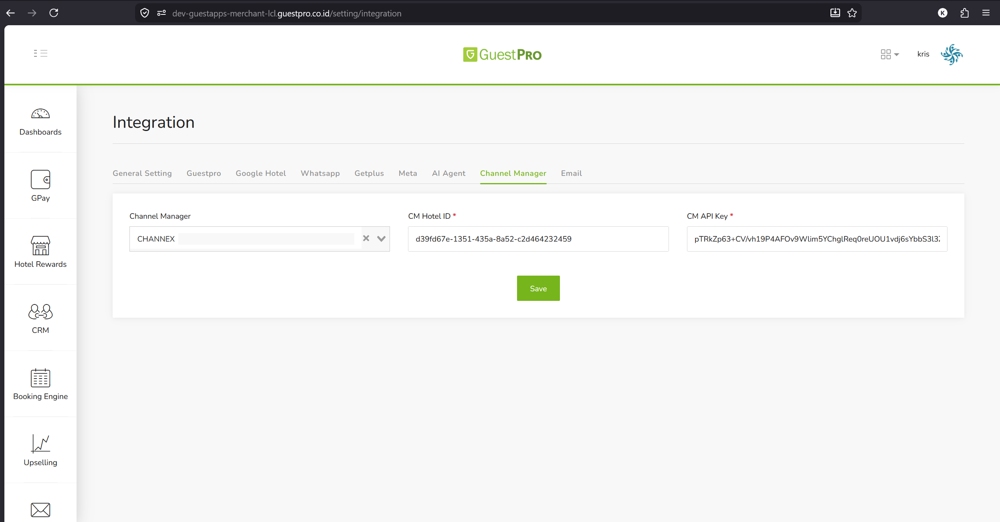

**Cara mendapat CM Hotel ID:**

- Buka Channex → menu **Properties**
- Klik **Actions → Edit** pada property yang dimaksud
- Salin ID yang tertera di bagian atas form Edit Property

  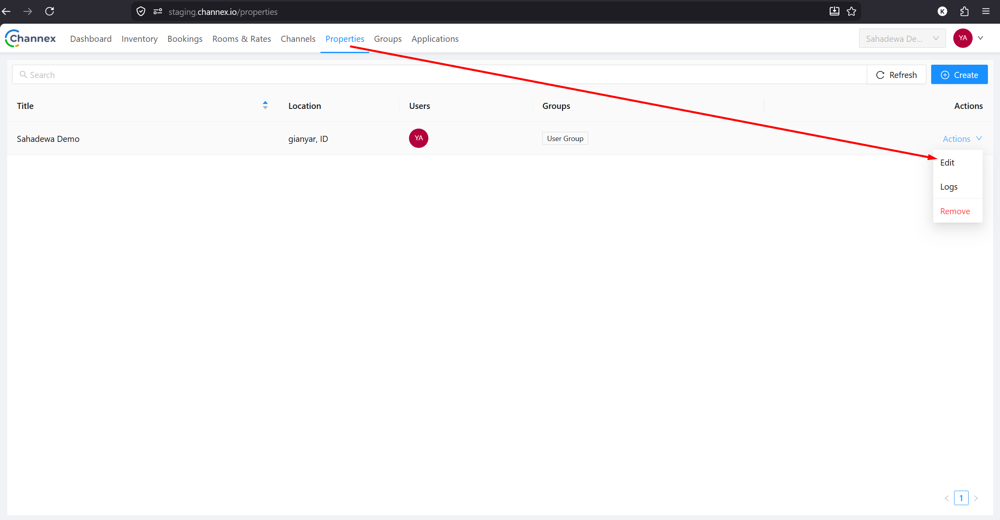

  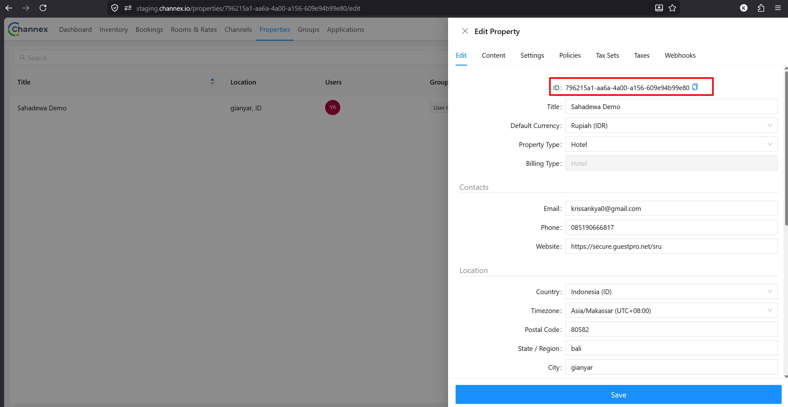

**Cara mendapat CM API Key:**

- Buka Channex → klik avatar → **Organization**
- Pilih **API Keys** di sidebar kiri
- Gunakan API Key yang sudah ada, atau klik **Create new API Key**

  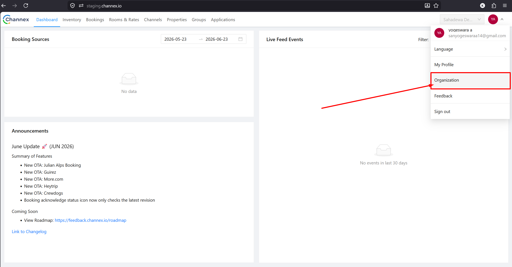

5. Setelah kedua field terisi, klik **Save**.

   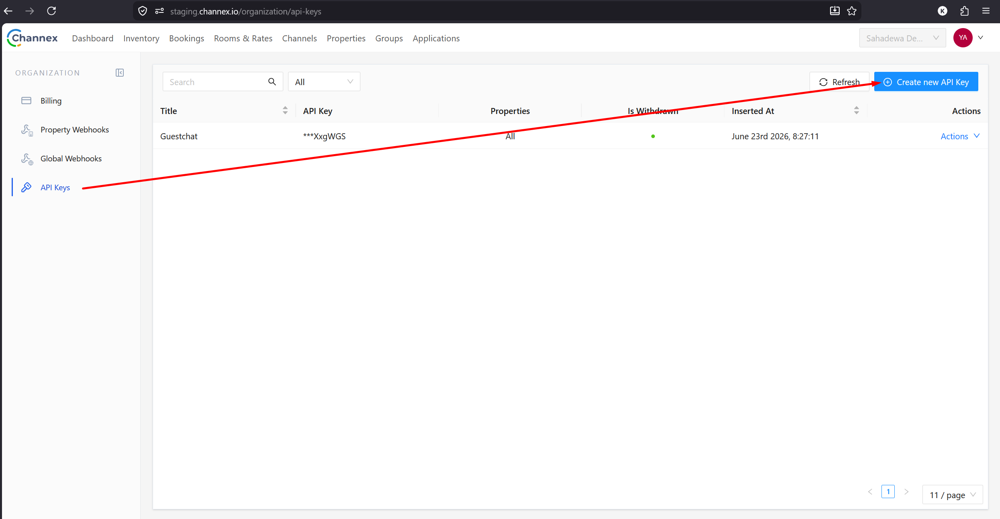

## Tahap 4 — Aktifkan Guestchat di Admin GP

1. Buka **MarketConnect → Merchant Detail** property yang dimaksud.
2. Di tab **General**, cari toggle **Chat App**.
3. Aktifkan toggle tersebut.

   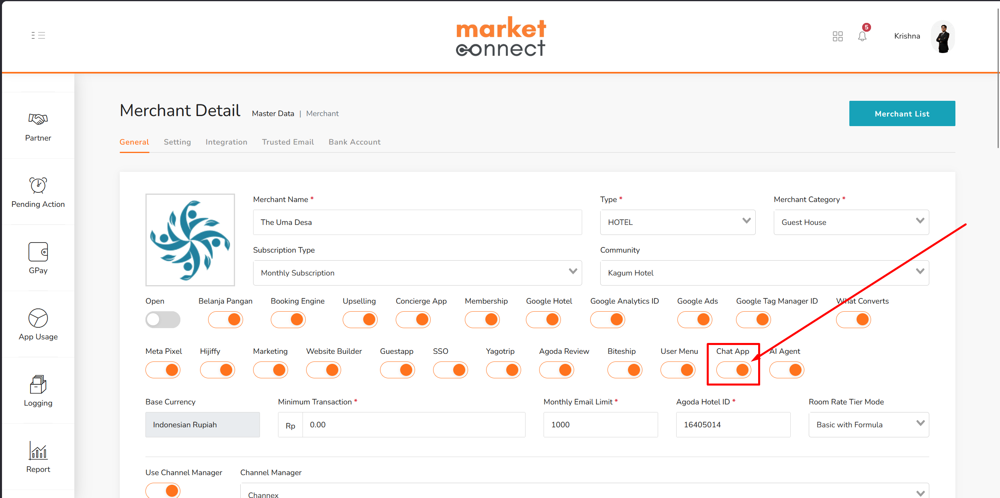

4. Cek di GuestPro dashboard merchant — menu **Chat** seharusnya sudah muncul di sidebar kiri.

   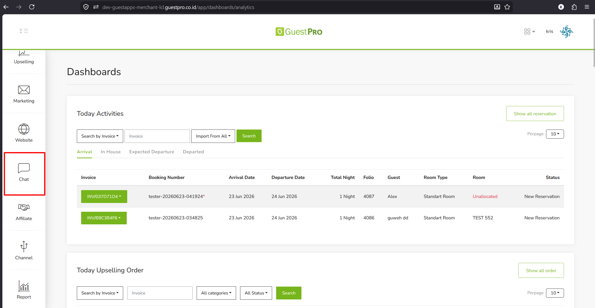
