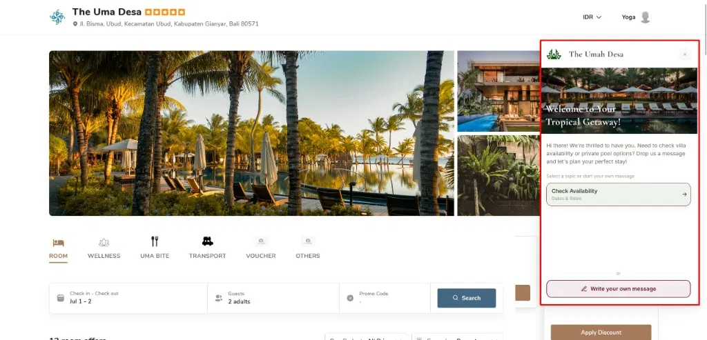
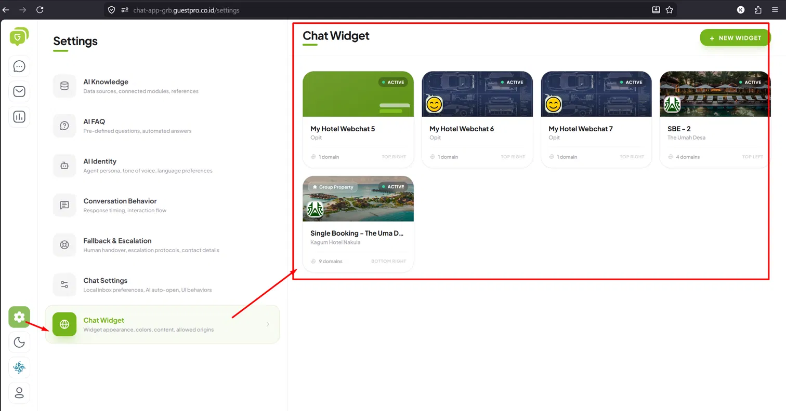
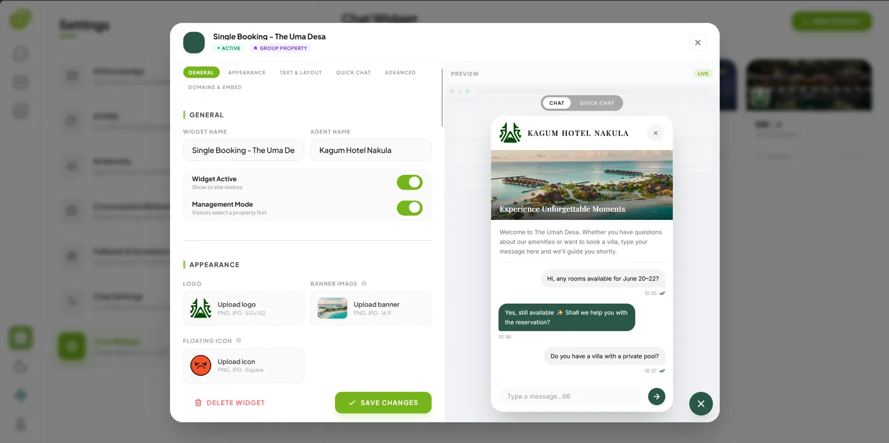
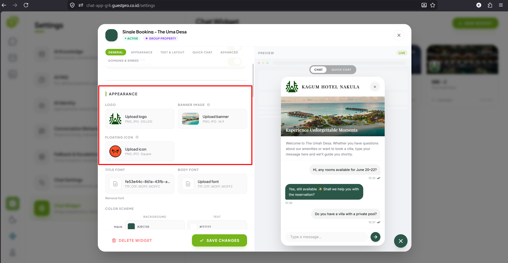
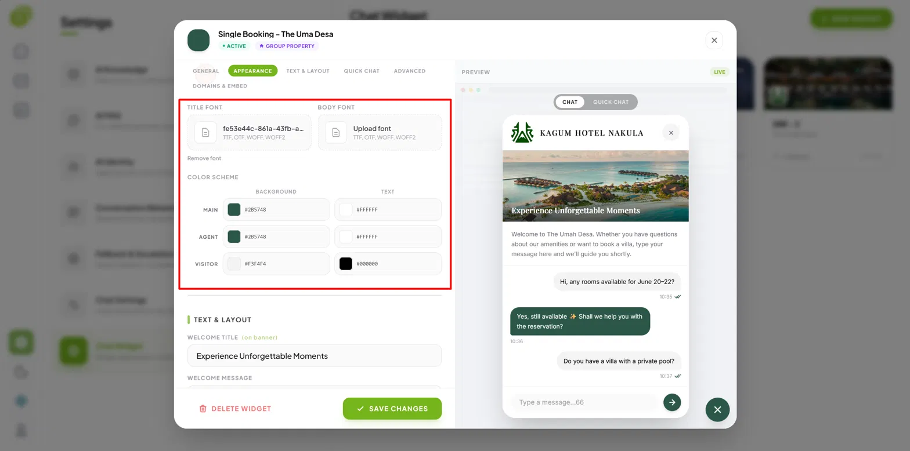
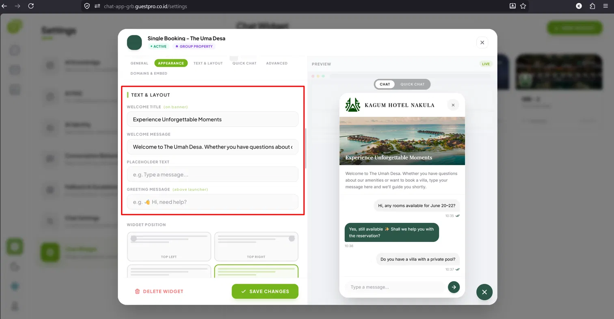
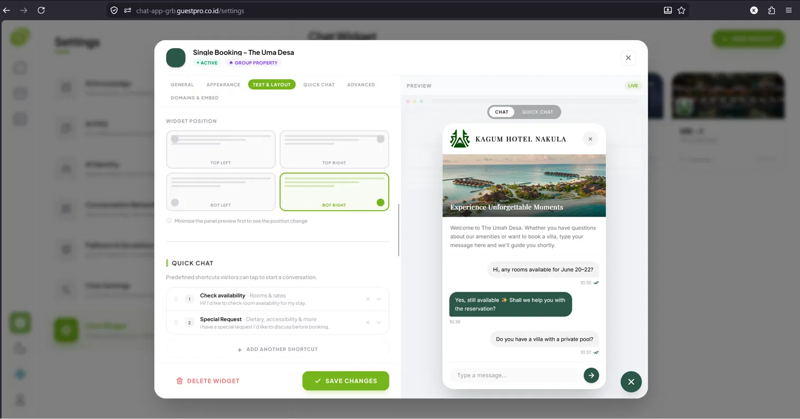
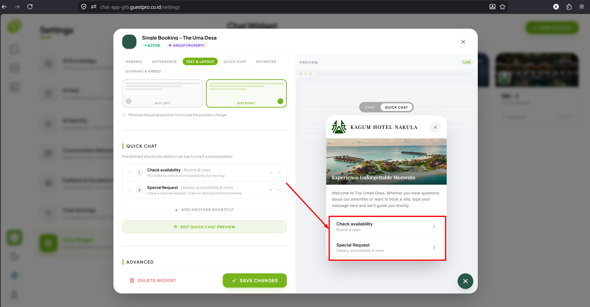
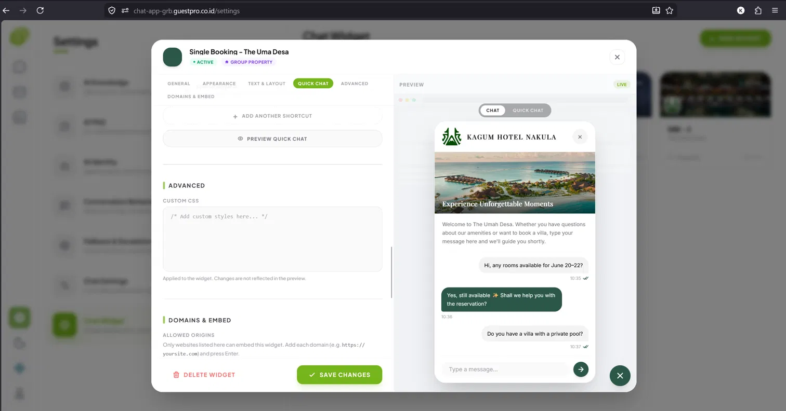
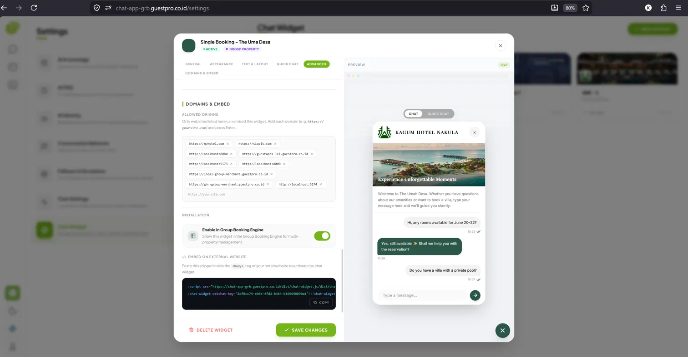

**Lokasi menu:** `Settings → Chat Widget`

Chat Widget adalah kotak chat yang bisa dipasang di website/Booking Engine property, sehingga calon tamu bisa langsung bertanya tanpa meninggalkan halaman. Satu property bisa memiliki lebih dari satu widget (misalnya beda desain untuk beda tujuan).





## Membuat Widget Baru

Klik **New Widget**, lalu isi pengaturan pada 6 tab berikut:

### 1. General
Nama widget (internal), nama agent yang tampil ke tamu, toggle **Widget Active** (tampil/tidak ke pengunjung), dan **Management Mode** (jika aktif, pengunjung memilih property dulu sebelum chat — cocok untuk grup properti).



### 2. Appearance
Logo, banner (tampil di layar sambutan sebelum tamu mulai chat), dan floating icon (ikon tombol chat mengambang).



Font judul & isi (upload file TTF/OTF/WOFF/WOFF2), serta skema warna (background & teks) untuk tiap elemen widget — **Main** (header), **Agent** (bubble chat staff), dan **Visitor** (bubble chat tamu).



### 3. Text & Layout
Welcome Title & Message (teks sambutan di banner), Placeholder Text (kolom input pesan), dan Greeting Message (bubble di atas tombol chat mengambang).



Posisi widget di layar bisa dipilih dari 4 opsi: **Top Left**, **Top Right**, **Bot Left**, atau **Bot Right**.



### 4. Quick Chat
Daftar shortcut siap pakai yang bisa langsung diklik pengunjung untuk memulai chat. Setiap shortcut terdiri dari judul, deskripsi singkat, dan pesan otomatis yang terkirim saat di-tap (misalnya "Check Availability" — "Rooms & rates"). Tambahkan shortcut baru lewat **Add Another Shortcut**, urutan item bisa diatur ulang dengan drag & drop, dan hasilnya bisa dicek langsung lewat **Preview Quick Chat**.



### 5. Advanced
**Custom CSS** — kolom untuk menambahkan styling tambahan pada widget. Perubahan di sini diterapkan langsung ke widget, namun tidak langsung terefleksi di panel preview.



### 6. Domains & Embed
Daftar domain website yang diizinkan menampilkan widget ini (**allowed origins** — widget tidak akan muncul di domain yang tidak terdaftar). Ada juga toggle **Enable in Group Booking Engine** untuk menampilkan widget ini di Group Booking Engine (manajemen multi-property). Tab ini juga menampilkan kode embed untuk dipasang di website, namun baru tersedia setelah widget pertama kali disimpan.



## Memasang Widget di Website (Install)

Dari grid daftar widget, klik tombol **Install** pada kartu widget untuk membuka kode embed secara cepat tanpa perlu masuk ke mode edit penuh. Salin snippet berikut ke halaman website:

```html
<script src="[VITE_WIDGET_BASE_URL]/dist/chat-widget.js"></script>
<chat-widget webchat-key="[kode-unik-widget]"></chat-widget>
```

:::caution[Gambar belum tersedia]
Tambahkan screenshot modal Install Widget dengan kode embed. Contoh: ``.
:::

:::note[Terhubung dengan Booking Engine]
Widget yang sudah dipasang otomatis terhubung ke inbox GuestChat yang sama dengan kanal lainnya (WhatsApp, Email, dll) — lihat juga [halaman Setup & Integrasi Kanal](/guestchat/channels/).
:::
