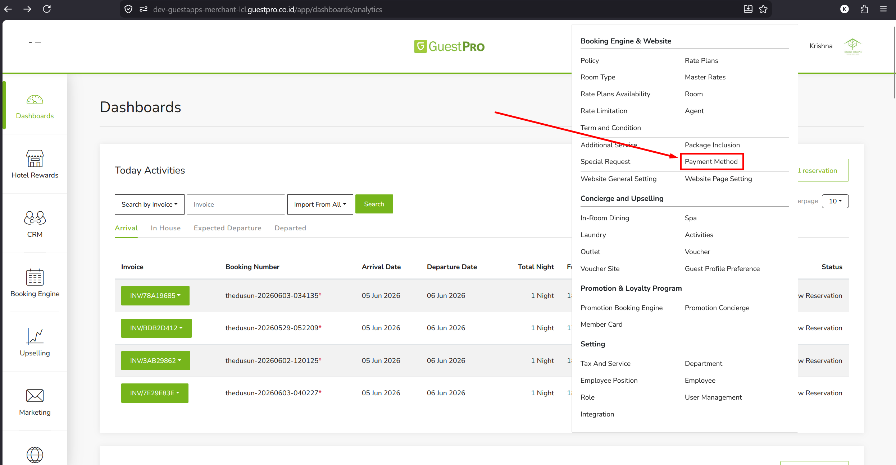
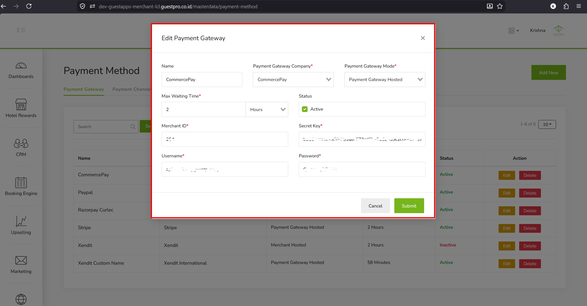
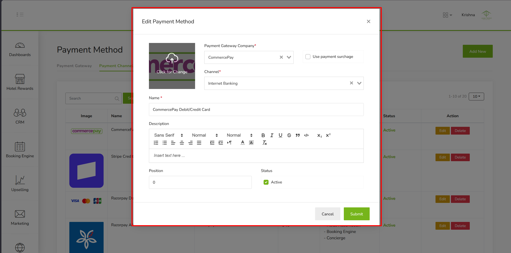

Commerce Pay adalah payment gateway dari Commerce Asia yang memungkinkan property menerima pembayaran secara online melalui berbagai metode pembayaran. Integrasi Commerce Pay di GuestPro memungkinkan guest melakukan pembayaran langsung melalui halaman *hosted* Commerce Pay yang aman dan terenkripsi.

:::caution[Batasan Currency]
Commerce Pay hanya tersedia untuk property yang menggunakan currency **Malaysian Ringgit (MYR)**. Konfigurasi ini berlaku untuk seluruh modul yang terhubung tanpa perlu setup tambahan per modul.
:::

## Modul yang Terdampak

| Modul | Sub-Modul |
|---|---|
| GRB > Booking Engine | Room Booking |
| GRB > Booking Engine | Upselling — Spa |
| GRB > Booking Engine | Upselling — Activity |
| GRB > Booking Engine | Upselling — Outlet (termasuk Restaurant) |
| GRB > Booking Engine | Upselling — In-Room Dining |
| PMS | Guest Bill Settlement |

## Metode Pembayaran yang Tersedia

| Metode | Keterangan |
|---|---|
| Credit Card | Debit/Credit Card via Commerce Pay |
| Online Banking (FPX) | Internet Banking B2C (Personal) & B2B (Corporate) |
| E-Wallet | ShopeePay dan e-wallet Malaysia lainnya |
| DuitNow QR | QR payment — scan via banking app atau e-wallet Malaysia |

## Prasyarat — Mendapatkan Kredensial Commerce Pay

Sebelum melakukan setup di GuestPro, property harus memiliki akun merchant Commerce Pay terlebih dahulu dan mendapatkan kredensial berikut.

| Kredensial | Keterangan |
|---|---|
| Merchant ID | ID unik merchant yang diberikan saat registrasi akun Commerce Pay |
| Secret Key | Kunci rahasia untuk autentikasi transaksi — jangan dibagikan ke pihak lain |
| Username | Username login akun merchant Commerce Pay |
| Password | Password login akun merchant Commerce Pay |

**Cara mendapatkan kredensial:**

1. Hubungi Commerce Pay melalui [commerce.asia](http://commerce.asia/)
2. Daftarkan akun merchant property
3. Lengkapi proses verifikasi dokumen property
4. Terima kredensial (Merchant ID, Secret Key, Username, Password)
5. Lanjutkan setup di GuestPro Dashboard

:::danger[Environment Kredensial]
Pastikan kredensial yang diterima sesuai dengan environment yang akan digunakan. Kredensial untuk kedua environment (sandbox/production) berbeda.
:::

## Cara Setup di GuestPro Dashboard

Navigasi: **Navbar atas → Booking Engine & Website → Payment Method**

Setup terdiri dari dua bagian yang harus dilakukan secara berurutan.

### Bagian 1 — Payment Gateway

Payment Gateway adalah konfigurasi koneksi antara GuestPro dan Commerce Pay.

1. Di halaman Payment Method, buka tab **Payment Gateway**.
2. Klik **Add New** untuk menambahkan **CommercePay**.
3. Lengkapi form berikut:

   | Field | Nilai |
   |---|---|
   | Name | CommercePay (terisi otomatis) |
   | Payment Gateway Company | CommercePay |
   | Payment Gateway Mode | Payment Gateway Hosted |
   | Max Waiting Time | Contoh: 2 Hours |
   | Status | Active |
   | Merchant ID | Dari akun merchant Commerce Pay |
   | Secret Key | Dari akun merchant Commerce Pay |
   | Username | Dari akun merchant Commerce Pay |
   | Password | Dari akun merchant Commerce Pay |

   

4. Klik **Submit** untuk menyimpan.

### Bagian 2 — Payment Channel

Payment Channel adalah konfigurasi metode pembayaran yang tampil ke guest saat checkout. Terdapat 4 channel Commerce Pay yang perlu dikonfigurasi masing-masing.

1. Di halaman Payment Method, buka tab **Payment Channel**.
2. Pilih channel Commerce Pay yang ingin diaktifkan → klik **Edit**.
3. Lengkapi form berikut:

   | Field | Nilai |
   |---|---|
   | Image / Logo | Upload logo metode pembayaran |
   | Payment Gateway Company | CommercePay |
   | Channel | Pilih sesuai metode: Internet Banking / Credit Card / E-Wallet / DuitNow |
   | Use Payment Surcharge | Centang jika ada biaya tambahan |
   | Name | Nama yang tampil ke guest. Contoh: CommercePay Debit/Credit Card |
   | Description | Deskripsi opsional |
   | Position | Urutan tampil saat checkout. 0 = paling atas |
   | Status | Active |

   

4. Klik **Submit**.
