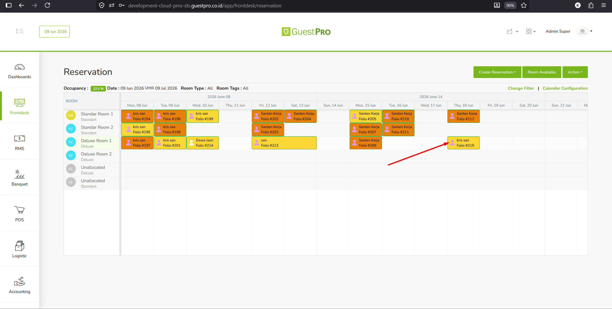
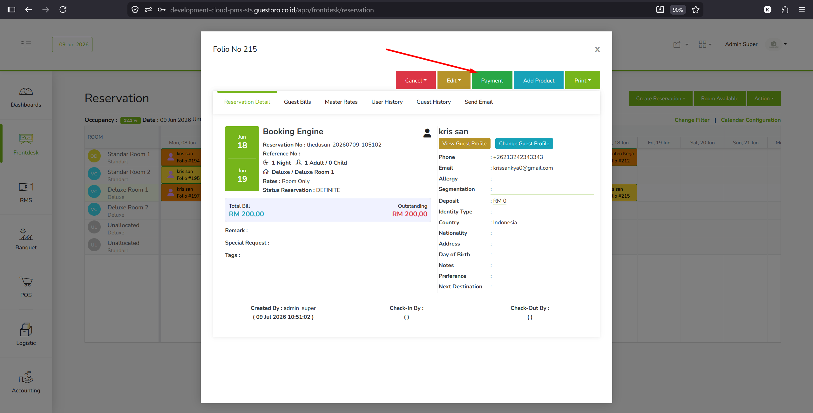
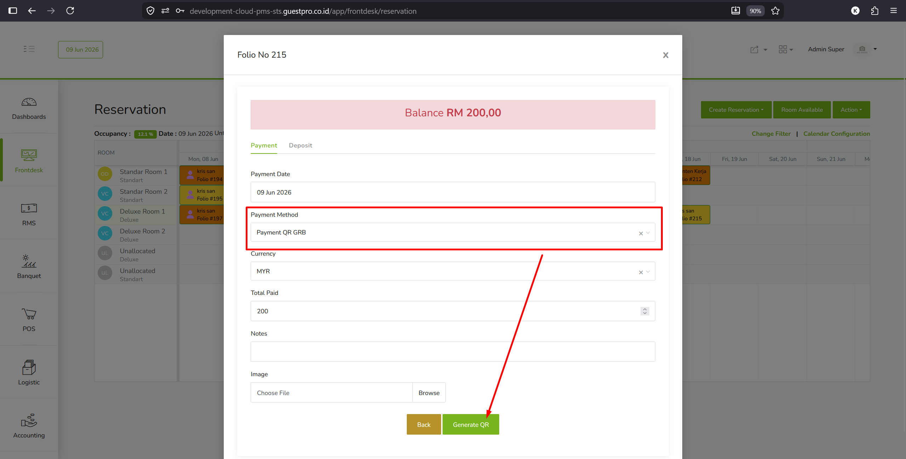
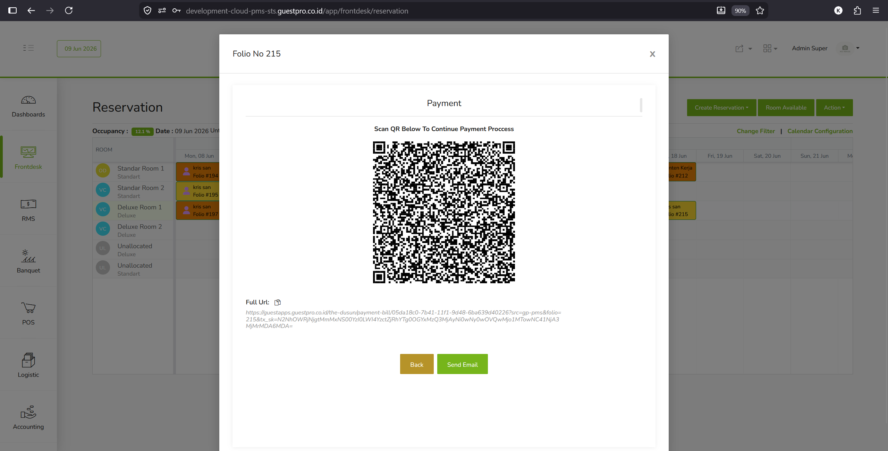
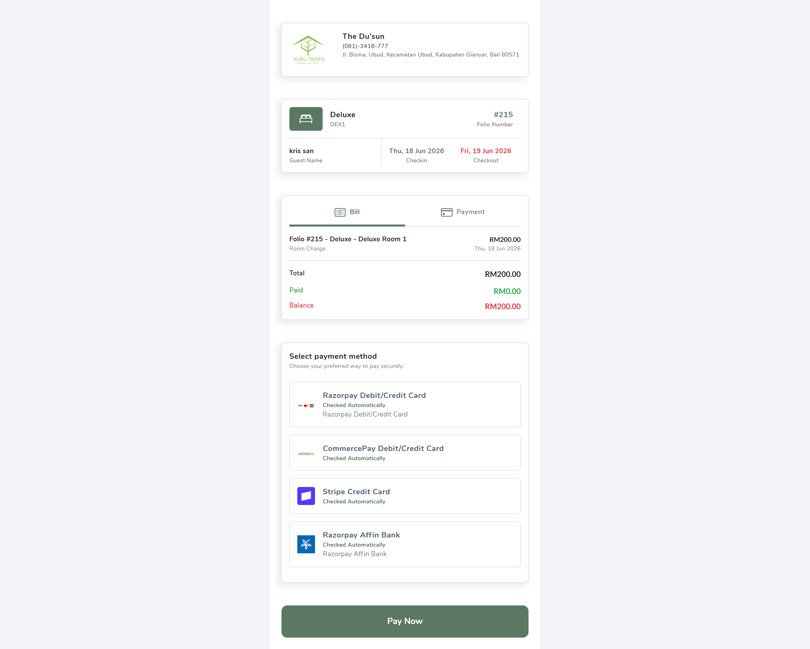

Fitur Guestbill / Online Payment memungkinkan property membuat tagihan online untuk tamu langsung dari PMS. Setelah tagihan dibuat, sistem menghasilkan QR code dan link pembayaran yang bisa ditunjukkan atau dikirim ke tamu. Tamu tinggal scan QR atau membuka link, lalu menyelesaikan pembayaran secara online.

:::note[Alur Cepat]
**Cek Payment Method di GRB** → **Setup Payment Method di PMS** → **Hubungkan PMS dengan GRB** → **Siap digunakan**
:::

:::caution[Sebelum Mulai]
Pastikan Payment Method yang ingin digunakan sudah di-setup dan berstatus **Active** di GRB terlebih dahulu. Jika payment method belum aktif di GRB, proses di PMS tidak akan berfungsi.
:::

## Tahap 1 — Cek Payment Method di GRB

Pastikan payment method yang diinginkan sudah aktif di sisi GRB.

1. Login ke GRB, buka menu **Payment Method** (di dalam **Booking Engine & Website**).
2. Di tab **Payment Gateway**, cek daftar payment gateway. Pastikan gateway yang ingin dipakai menunjukkan status **Active** di kolom Status.
3. Pindah ke tab **Payment Channel**, pastikan payment channel yang ingin dipakai juga berstatus **Active**.

:::danger[Penting]
Jika status masih **Inactive**, aktifkan terlebih dahulu sebelum lanjut ke tahap berikutnya.
:::

## Tahap 2 — Setup Payment Method di PMS

Setelah payment method di GRB aktif, lanjutkan ke PMS untuk membuat payment method baru.

1. Login ke PMS, buka menu **Master Data → Payment Method**.
2. Di halaman Payment Method, klik tombol **ADD NEW** untuk menambah payment method baru.
3. Isi form sesuai kebutuhan property. Field yang bisa disesuaikan: **Name**, **Payment Account**, **Assign to**, dan lainnya.

:::danger[Wajib Diperhatikan]
Untuk field **Payment Method Type**, pilih **Payment Integration**. Field ini **tidak boleh** diisi dengan pilihan lain, karena inilah yang menghubungkan payment ke sistem online.
:::

4. Setelah semua terisi, simpan payment method tersebut.

## Tahap 3 — Hubungkan PMS dengan GRB

Payment method yang baru dibuat di PMS perlu dihubungkan (mapping) ke payment method di GRB.

1. Kembali ke dashboard GRB, buka menu **Integration** (di dalam **Setting**).
2. Buka tab **Guestpro → Payment**. Akan muncul dua kolom: **Payment Guestapp** (kiri) dan **Payment Reference** (kanan).
3. Pada baris payment method yang dituju, pilih **Payment Reference** yang sesuai dengan payment method yang dibuat di PMS.
4. Setelah mapping selesai, setup selesai dan fitur siap digunakan.

---

## Cara Menggunakan

*Modul Frontdesk – GuestPro PMS.* Fitur ini memungkinkan property mengirimkan tagihan (bill) sebuah reservasi kepada tamu dalam bentuk **QR Code** atau **link pembayaran**, sehingga tamu bisa membayar secara online tanpa transaksi tunai di front office. Alur ini diproses langsung dari detail Folio reservasi.

### Prasyarat

1. Payment method online (payment gateway) — misalnya Razorpay, Stripe, atau CommercePay — sudah di-setup dan **Active** di Booking Engine / Revenue Booster (lihat [Tahap 1](#tahap-1--cek-payment-method-di-grb) di atas — pastikan sudah **Active**). Metode inilah yang akan muncul pada Guest saat mereka mengakses QR atau link payment.
2. Reservasi yang akan ditagih sudah dibuat dan memiliki saldo tagihan (*outstanding*/*balance*) yang belum terbayar.
3. Akun bank penerima dana sudah didaftarkan bersama tim support GuestPro agar dana hasil pembayaran dapat ditarik (*withdraw*).

:::note[Istilah]
Singkatan "GRB" pada metode Payment QR GRB mengacu pada Guestpro Revenue Booster.
:::

### 1. Buka Reservasi pada Reservation Chart

Login ke PMS GuestPro, lalu masuk ke modul **Frontdesk → Reservation**. Pada Reservation Chart, klik pada kotak reservasi (folio) milik tamu yang tagihannya akan dibayarkan secara online.

### 2. Buka Detail Folio dan Klik Payment

Setelah kotak reservasi diklik, akan terbuka jendela detail **Folio** yang menampilkan ringkasan reservasi (tanggal check-in/out, tipe kamar, data tamu, Total Bill, dan Outstanding). Untuk memulai proses pembayaran online, klik tombol **Payment** berwarna hijau pada bagian atas jendela.

### 3. Isi Form Payment dan Generate QR

Pada form Payment, lengkapi data pembayaran. Bagian terpenting adalah **Payment Method**: pilih metode pembayaran online (misalnya **Payment QR GRB**). Setelah semua kolom terisi, klik tombol **Generate QR** untuk membuat QR Code / link pembayaran.

| Field | Keterangan |
|---|---|
| Payment Date | Tanggal pembayaran diproses. |
| Payment Method | Metode pembayaran. Pilih metode online (mis. Payment QR GRB) agar sistem menghasilkan QR / link pembayaran. |
| Currency | Mata uang tagihan yang akan dibayar. |
| Total Paid | Nominal yang akan dibayarkan tamu. Secara default terisi sesuai balance tagihan. |
| Notes | Catatan tambahan untuk transaksi (opsional). |
| Image | Unggah bukti/gambar pendukung bila diperlukan (opsional). |

### 4. Tampilkan QR Code / Kirim Link ke Tamu

Sistem akan menampilkan **QR Code** beserta **Full URL** tagihan. Ada dua cara menyampaikannya kepada tamu:

- Tunjukkan QR Code di layar agar tamu dapat memindai (scan) langsung menggunakan kamera ponselnya; atau
- Salin Full URL (ikon copy) untuk dikirim manual, atau klik tombol **Send Email** agar link pembayaran terkirim otomatis ke email tamu.

## Tampilan di Sisi Tamu

Setelah tamu memindai QR atau membuka link, tamu akan diarahkan ke halaman **GuestBill**. Halaman ini menampilkan informasi property, detail reservasi (nama tamu, folio, tanggal check-in/out), rincian tagihan (Total, Paid, Balance), serta pilihan **payment method**. Tamu memilih metode yang diinginkan lalu menekan tombol **Pay Now** untuk menyelesaikan pembayaran.

:::tip[Setelah Pembayaran Berhasil]
Setelah tamu menyelesaikan pembayaran, status pembayaran akan terupdate dan tercatat pada Folio reservasi (Paid bertambah, Balance berkurang).
:::
